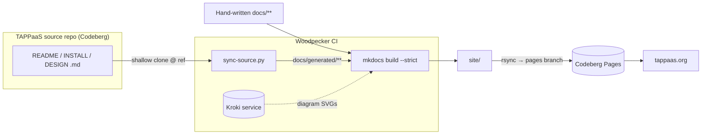

# Building the TAPPaaS Documentation

How [tappaas.org](https://tappaas.org) is built and published. This repo is the
**sole home of the site** (ADR-001); the previous GitHub-Actions publish path is
retired.

- **Generator:** MkDocs + Material theme (`mkdocs.yml`, `requirements.txt`).
- **CI:** Woodpecker on Codeberg (`.woodpecker.yml`).
- **Hosting:** Codeberg Pages (the new git-pages server), served from the
  orphan `pages` branch.
- **Source content:** a build-time sync pulls docs *out of the TAPPaaS source
  repo* — see [§ Source-sync](#source-sync). The upstream side of this contract
  is [TAPPaaS/BUILD.md](https://codeberg.org/TAPPaaS/TAPPaaS/src/branch/main/BUILD.md).



## Source-sync

`scripts/sync-source.py` (ADR-001 §12, "WS0") is what copies the source repo's
`README` / `INSTALL` / `DESIGN` / etc. files into the site. It does **not**
rsync a local checkout — it shallow-clones the source repo at a pinned ref and
transforms allow-listed files into pages under `docs/generated/`:

- **Where from:** `codeberg.org/TAPPaaS/TAPPaaS` at `TAPPAAS_SOURCE_REF`
  (default `main`), fetched with `git clone --depth 1 --branch <ref>`.
- **What:**
  - an **`ALLOW_LIST`** of exact `source path → output page → title` mappings
    (e.g. `INSTALL.md → install/index.md`, `src/foundation/INSTALL.md →
    generated/install.md`, each app's `INSTALL.md`, `GLOSSARY.md`, module
    `DESIGN.md`s);
  - **`GLOB_RULES`** that sweep in *every* manager/controller/module `README.md`
    automatically (`src/foundation/tappaas-cicd/manager/*/README.md`,
    `.../controller/*/README.md`, `src/foundation/*/README.md`,
    `src/apps/*/README.md`), so new upstream modules appear in the nav with **no
    docs-repo change**.
- **Transforms:** each generated page gets a front-matter title and a
  "GENERATED FROM SOURCE — do not edit here" banner; relative links are rewritten
  to absolute Codeberg URLs at the pinned ref (or to the sibling on-site page when
  it too is synced); a `SUMMARY.md` is emitted per generated dir for
  `mkdocs-literate-nav`.
- **Drift guard:** if an allow-listed file is missing upstream, or a glob matches
  nothing, the script `exit`s non-zero and **fails the build**. Move a source file
  → update the allow-list here.

> Editing rule: never edit `docs/generated/**` — those pages are overwritten every
> build. Change the file in the source repo instead. Everything else under `docs/`
> is hand-written and owned by this repo.

## CI pipeline

`.woodpecker.yml`, on Codeberg CI:

1. **`build`** (`python:3.12-slim`): install `git`, `pip install -r
   requirements.txt`, start a **Kroki** service (renders diagrams; falls back to
   public `kroki.io` if the service container never comes up), run
   `python scripts/sync-source.py`, then `mkdocs build --strict`.
2. **`deploy-pages`** (`alpine`): `rsync` the built `site/` into the orphan
   **`pages`** branch and push. `main`/`staging` own the site root; `spike-*`
   branches publish under `spikes/<branch>/`. Never runs on pull requests.

- **Triggers:** `push`, `manual`, and a nightly **`cron`** on `main`/`staging`/
  `spike-*` — the cron re-runs the source-sync so upstream doc changes reach the
  site even when this repo has no commits. `pull_request` builds but does not
  deploy.
- **Secret:** `codeberg_token` (a Codeberg application token with write access to
  this repo), set in the Woodpecker UI.

## Hosting (Codeberg Pages)

Served by Codeberg's new git-pages server from the `pages` branch (ADR-001
§11a.5):

- Production: **tappaas.org** / **www.tappaas.org**
- Staging: **staging.tappaas.org**
- Direct/fallback: `tappaas.codeberg.page/Documentation/`
- Branch previews: `tappaas.codeberg.page/Documentation/spikes/<branch>/`

Custom domains are authorized purely via DNS: a `CNAME → codeberg.page.` plus a
`TXT _git-pages-repository.<domain> → https://codeberg.org/TAPPaaS/Documentation.git`.
The repo has no git-pages webhooks (the CI token can't manage hooks), so the
deploy step POSTs a synthetic Forgejo push payload to each Pages target itself.
Serving goes through a ~600 s edge cache — a fresh deploy can take up to ~10 min
to appear.

## Build it locally

```bash
pip install -r requirements.txt
python scripts/sync-source.py     # pull generated pages from the source repo
mkdocs serve                      # live preview at http://127.0.0.1:8000
# or: mkdocs build --strict       # produce site/ exactly as CI does
```

Override the source branch with `TAPPAAS_SOURCE_REF=<branch>` before running
`sync-source.py`. Diagram rendering needs a reachable Kroki server (the local
`mkdocs.yml` points at `http://localhost:8000`); `docker-compose.yml` in this repo
can bring one up.
