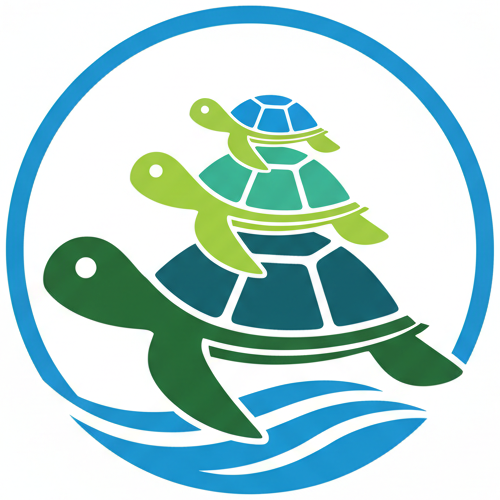

# Logo

  

## Turtles All the Way Down

The TAPPaaS logo depicts turtles stacked upon each other, a visual reference to the famous anecdote ["Turtles all the way down"](https://en.wikiquote.org/wiki/Turtles_all_the_way_down).

In the original tale, when asked what the Earth rests upon, the answer is "a turtle." And what does that turtle stand on? "Another turtle." And below that? "It's turtles all the way down."

## The Foundation of Your Digital Life

For TAPPaaS, this imagery carries a deeper meaning: **TAPPaaS is the foundation for your digital services**.

Just as the turtles in the story provide an infinite, stable base, TAPPaaS provides the foundational platform upon which all your digital services rest. Your applications, your data, your automations - they all stand securely on TAPPaaS, which in turn handles the complexity of infrastructure, security, networking, and operations.

You don't need to worry about what's "below" - TAPPaaS has you covered, all the way down.
