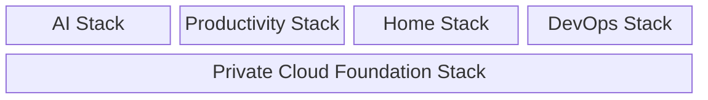
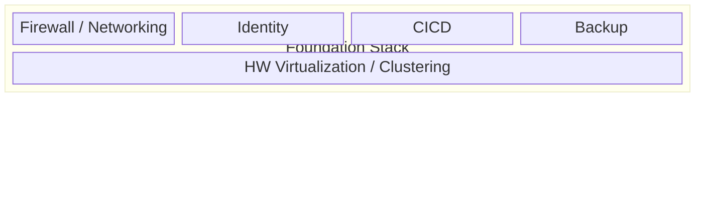

# Capabilities

## Overview

TAPPaaS represents a comprehensive IT solution designed through both top-down analysis of user needs and bottom-up examination of practical implementations.

At a very high level the TAPPaaS solution delivers the following very high level of capabilities. We call it the **TAPPaaS Capability Stacks**

- Private Cloud Foundation Stack: The foundation upon which the other Stacks can function and integrate
- AI Stack: a set of capabilities aiming at providing private AI
- Productivity Stack: Classical capabilities such as file sharing, collaboration tooling, password management, ...
- Home Stack: Capabilities that a private individual or family needs, such as music and video streaming, picture store
- DevOps Stack: the capabilities needed in order to develop, test deploy software

More stacks are planned and not all of the above are implemented yet. TAPPaaS also allow any community or privately modules to be deployed

---

## Foundation Stack

The infrastructure layer providing virtualization, networking, storage, security, backup, and identity management upon which all other stacks depend.

THe foundation delivers the following 5 core capabilities upon which all other Stacks rely:

- HW Virtualization / Clustering: Abstracting physical resources into logical flexible virtual machines and storage tanks
- Firewall / Networking: A solid network design with zones, firewall, proxy services, fault tolerant DNS and DHCP
- Identity: Deliver a secure and solution wide identity management setup
- CICD: Automated install/update and self management
- Backup: automated 3-2-1 backup strategy

---

## AI Stack

Private AI capabilities including local large language models, chat interfaces, and AI-powered automation workflows.

---

## Productivity Stack

Business and personal productivity tools including file sharing, workflow automation, and collaboration services.

---

## Home Stack

Home and family-oriented services such as home automation, media streaming, and personal data management.

---

## DevOps Stack

Software development and operations capabilities including CI/CD pipelines, code repositories, and deployment automation.

