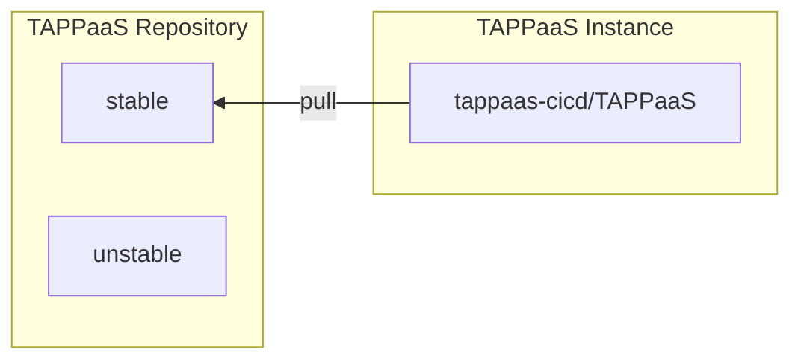
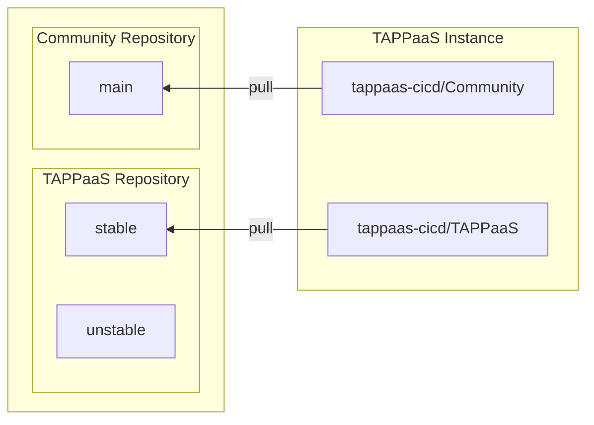
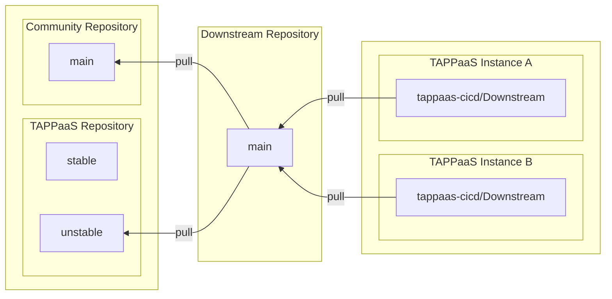
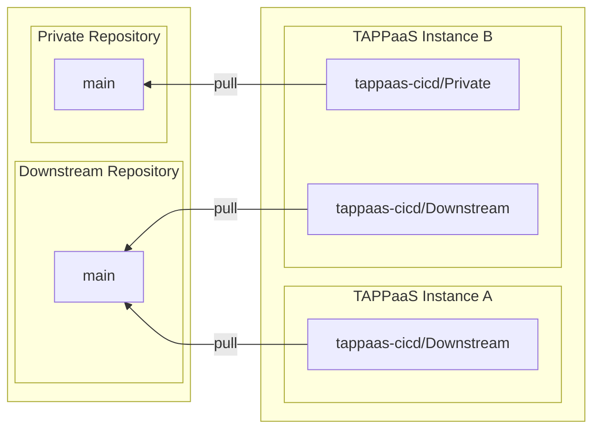
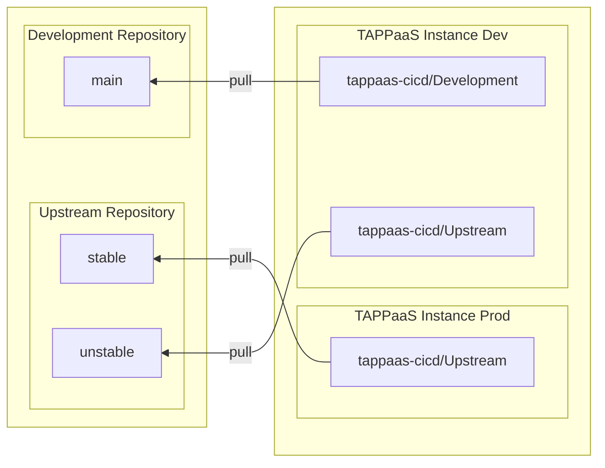

# Git Structure

This page documents the Git repository organization and GitOps workflow for TAPPaaS.

Fundamentally TAPPaaS uses a GitOps pull setup. on a regular schedule a TAPPaaS solution will pull the latest update from an upstream repository and then performs an update operation on the running TAPPaaS instance based on the new updated TAPPaaS configuration.

This is done by the "tappaas-cicd" module, which as a consequence will maintain a git clone of the TAPPaaS upstream repository

There are several ways this can be set up, but there are 4 basic patterns or use cases, which we are going through below
The actual setup for your TAPPaaS is configured in config/configuration.json on the tappaas user on the tappaas-cicd module
there is a command "repository.sh" that will change the configuration.

Further if you are Developing modules for TAPPaaS or developing applications that are to be deployed as modules then there are further variations which is documented at the end

---

## Basic TAPPaaS GitOps

This is the basic setup that you will get if you follow the installation guide. The default upstream TAPPaaS repository is the Open Source REPO references on this documentation page top right corner. You can install the standard modules that comes from the TAPPaaS project.

you have to decide if you want to pull form the stable or unstable branch (the latter is really only for testing and staging)

---

## Community Repositories

The next step up is adding the Community Repository to the mix, this expands the actual modules you can install.

---

## Downstream Repositories

If you manage a set of TAPPaaS Instances you might want to "inject" a staging repository between the open source repositories and your installation. that way you can control what modules are available, and change default values to mach you deployment needs

---

## Private Repositories

Finally you can add you own private repositories to the mix.

## Developing TAPPaaS Modules

So you want to contribute to TAPPaaS. We are honoured, thank you.

Essentially when developing modules you want a test TAPPaaS Instance in parallel with your production instance. If the module you are developing is sufficiently seperate from other modules then you can do module development on a production system. More on that below

What you want is a setup like the one below. The actual running instance of TAPPaaS can be achieved in any of the above scenarios but hte essenst is to have a private branch, likely on a private git system that will be upstream from the development instance of TAPPaaS

---

## Developing applications to be deployed on TAPPaaS

