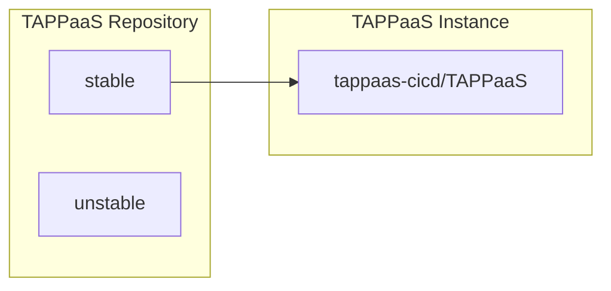
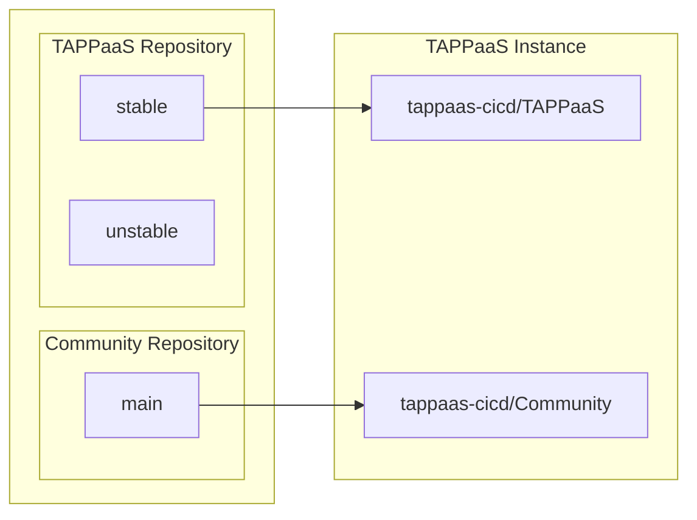
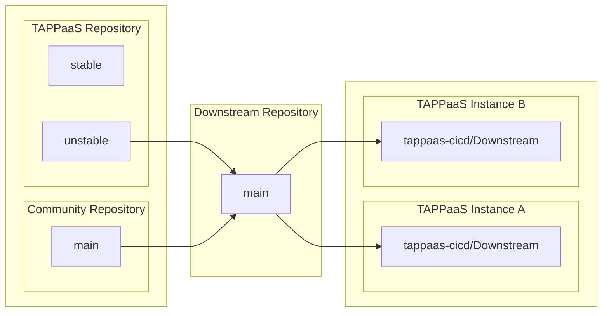
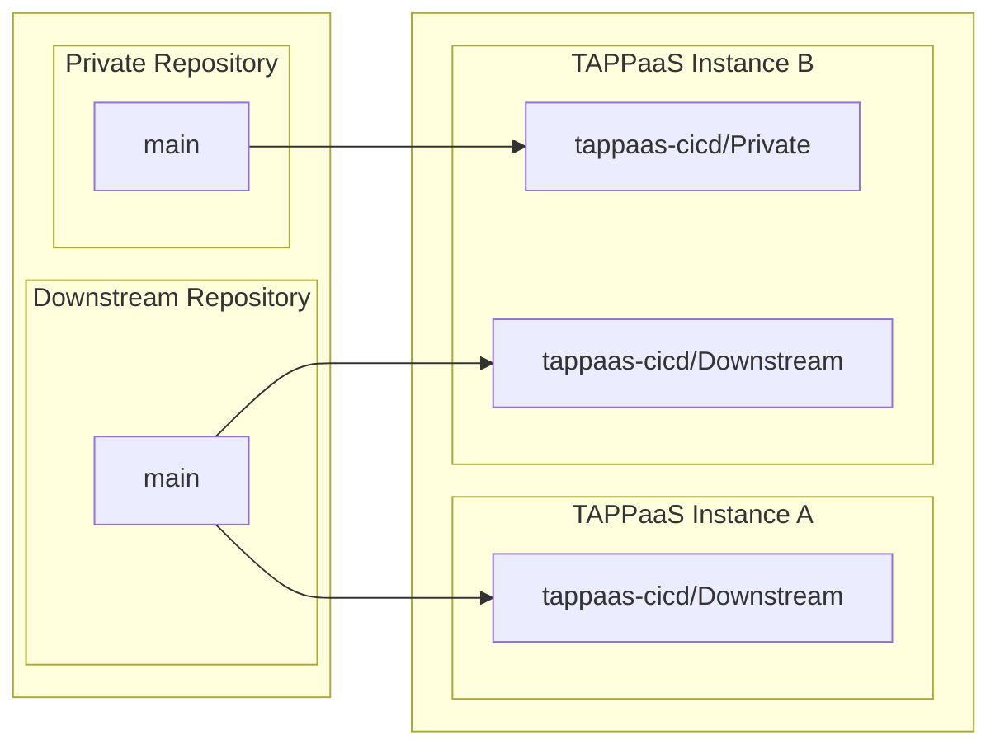

# Git Structure

This page documents the Git repository organization and GitOps workflow for TAPPaaS.

---

## Basic TAPPaaS GitOps

*To be documented.*

---

## Community Repositories

*To be documented.*

---

## Downstream Repositories

*To be documented.*

---

## Private Repositories

*To be documented.*

