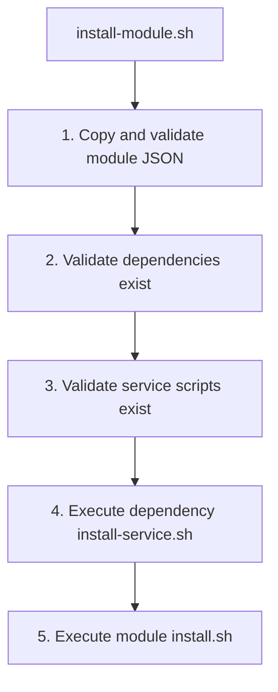
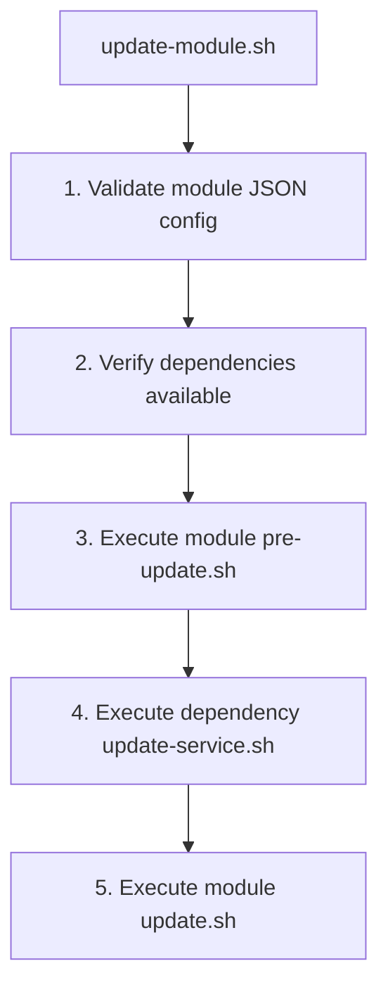
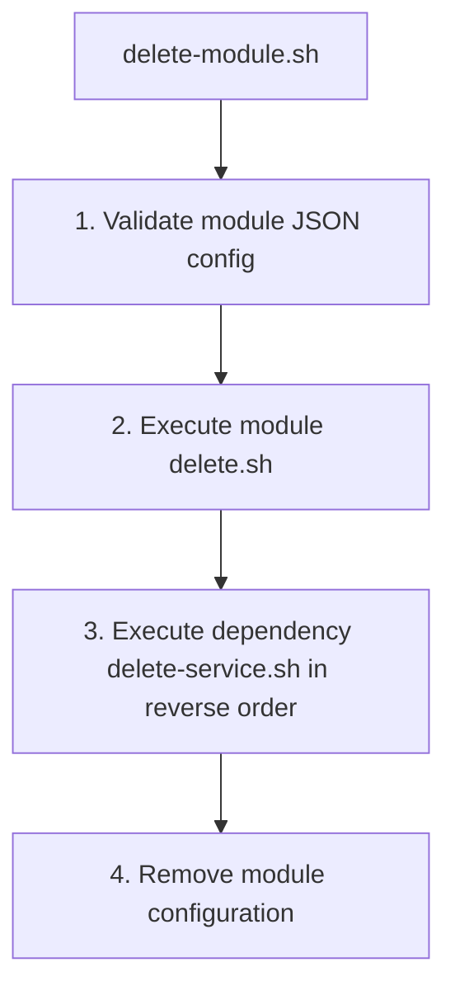
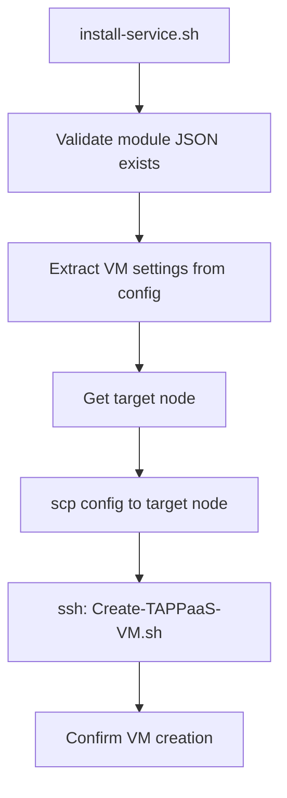
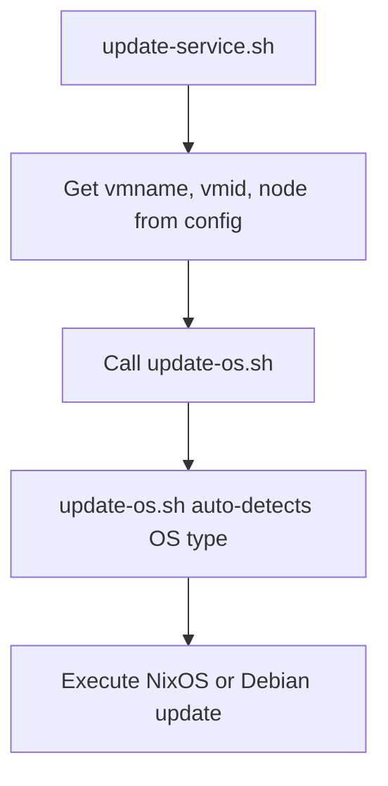

# Module Structure

This page documents the structure and conventions for TAPPaaS modules.

---

## Module Definition

Each TAPPaaS module is defined by a `<module>.json` file that specifies its configuration, resource requirements, and dependencies.

### Core Fields

Basic module metadata and dependency declarations used by all modules.

| Field | Type | Description | Default |
|-------|------|-------------|---------|
| `version` | string | Version of the module (format: `X.Y.Z`) | - |
| `description` | string | Text displayed on Proxmox summary page | "" |
| `maintainer` | string | Maintainer of the module (typically GitHub username) | "" |
| `releaseDate` | string | Date version was released (format: `YYYY-MM-DD`) | - |
| `status` | string | Development stage: `Development`, `Testing`, `Production`, `Deprecated` | Development |
| `location` | string | Absolute path to module directory (auto-set by copy-update-json.sh) | - |
| `dependsOn` | array | List of services this module depends on (format: `module:service`) | [] |
| `provides` | array | Services this module delivers | [] |

### Cluster:VM Service Configuration

Fields used by the `cluster:vm` service to create and configure the module's virtual machine.

| Field | Type | Description | Default |
|-------|------|-------------|---------|
| `vmid` | integer | Unique VM ID across nodes (100-999999) | *required* |
| `vmname` | string | VM/module/hostname name | *required* |
| `vmtag` | string | Proxmox tags (comma-separated) | TAPPaaS |
| `node` | string | Target Proxmox node (pattern: `tappaas[0-9]+`) | tappaas1 |
| `bios` | string | BIOS type: `ovmf` or `seabios` | ovmf |
| `ostype` | string | Proxmox VM optimization: `l26`, `l24`, `win10`, `win11`, `other` | l26 |
| `cores` | integer | CPU cores allocated (1-128) | 2 |
| `memory` | integer | RAM in megabytes (min 512) | 4096 |
| `diskSize` | string | Disk size with unit (e.g., `8G`, `500M`) | 8G |
| `storage` | string | Storage pool name | tanka1 |
| `imageType` | string | Image source: `clone`, `iso`, `img`, `apt` | *required* |
| `image` | string | Image identifier (interpretation depends on imageType) | *required* |
| `imageLocation` | string | URL for image file (used with `iso`/`img` types) | - |
| `cloudInit` | string | Cloud-init support: `"true"` or `"false"` | "true" |
| `bridge0` | string | Proxmox bridge for net0 | lan |
| `mac0` | string | MAC address for net0 (format: `XX:XX:XX:XX:XX:XX`) | - |
| `zone0` | string | Security zone for net0 (must exist in zones.json) | mgmt |
| `trunks0` | string | Additional zones to trunk on net0 (semicolon-separated) | - |
| `bridge1` | string | Proxmox bridge for net1 (optional second NIC) | lan |
| `mac1` | string | MAC address for net1 | - |
| `zone1` | string | Security zone for net1 | mgmt |
| `trunks1` | string | Additional zones for net1 (semicolon-separated) | - |

### Cluster:HA Service Configuration

Fields used by the `cluster:ha` service to configure high availability and replication.

| Field | Type | Description | Default |
|-------|------|-------------|---------|
| `HANode` | string | Secondary node for HA (`NONE` or `tappaas[0-9]+`) | NONE |
| `replicationSchedule` | string | Cron-style replication interval | */15 |

### Firewall:proxy Service Configuration

Fields used by the `firewall:proxy` service to configure reverse proxy routing via Caddy on OPNsense.

| Field | Type | Description | Default |
|-------|------|-------------|---------|
| `proxyDomain` | string | Public domain name for the reverse proxy | `<vmname>.<tappaas.domain>` |
| `proxyPort` | integer | Target port on the module VM (1-65535) | 80 |

---

## Standard Scripts

TAPPaaS provides standard scripts for module lifecycle management. These scripts are located in `/home/tappaas/bin/` on the tappaas-cicd module.

### Install

The `install-module.sh` script installs a module and its dependencies.

**Usage:**

```bash
install-module.sh <module-name> [--<field> <value>...]
install-module.sh vaultwarden
install-module.sh litellm --node tappaas2
```

**Parameters:**

| Parameter | Description |
|-----------|-------------|
| `<module-name>` | Name of the module to install (required) |
| `--<field> <value>` | Override any JSON configuration field |
| `-h, --help` | Display help message |

**Scripts Sourced:**

- `copy-update-json.sh` - Copies and validates module JSON configuration
- `common-install-routines.sh` - Shared installation routines

**Execution Flow:**



1. **Copy and validate** - Copies `<module>.json` to config directory, applies field overrides
2. **Validate dependencies** - Checks each service in `dependsOn` exists and is provided by another module
3. **Validate service scripts** - Ensures the module has scripts for each service it `provides`
4. **Execute dependency installers** - Calls `install-service.sh` for each dependency's provider
5. **Run module installer** - Executes the module's own `install.sh` if present

**Module install.sh:**

Each module may provide an `install.sh` script in its directory. This script receives the module name as its first argument and should handle module-specific installation tasks.

### Update

The `update-module.sh` script updates a module and its dependencies.

**Usage:**

```bash
update-module.sh <module-name>
update-module.sh vaultwarden
```

**Parameters:**

| Parameter | Description |
|-----------|-------------|
| `<module-name>` | Name of the module to update (required) |
| `-h, --help` | Display help message |

**Scripts Sourced:**

- `common-install-routines.sh` - Provides `check_json()` function

**Execution Flow:**



1. **Configuration validation** - Verifies the module's JSON config is well-formed
2. **Dependency verification** - Confirms each declared dependency exists and is available
3. **Pre-update hook** - Executes the module's optional `pre-update.sh` script
4. **Service dependencies** - Runs each dependency provider's `update-service.sh`
5. **Module update** - Executes the module's own `update.sh` script

**Module Scripts:**

| Script | Description |
|--------|-------------|
| `pre-update.sh` | Optional preparation before update (e.g., stop services, backup) |
| `update.sh` | Main update logic (e.g., pull latest config, restart services) |

### Delete

The `delete-module.sh` script removes a module and cleans up its dependencies.

**Usage:**

```bash
delete-module.sh <module-name>
delete-module.sh vaultwarden
```

**Parameters:**

| Parameter | Description |
|-----------|-------------|
| `<module-name>` | Name of the module to delete (required) |
| `-h, --help` | Display help message |

**Scripts Sourced:**

- `common-install-routines.sh` - Provides `check_json()` function

**Execution Flow:**



1. **Configuration validation** - Verifies the module's JSON config exists
2. **Module delete** - Executes the module's own `delete.sh` script first
3. **Service cleanup** - Runs each dependency provider's `delete-service.sh` in **reverse order** of `dependsOn`
4. **Config removal** - Removes the module's JSON configuration file

**Key Differences from Install/Update:**

| Aspect | Install/Update | Delete |
|--------|----------------|--------|
| Module script | Runs last | Runs first |
| Dependency order | Forward order | Reverse order |
| Service script | `install-service.sh` / `update-service.sh` | `delete-service.sh` |

**Module Scripts:**

| Script | Description |
|--------|-------------|
| `delete.sh` | Cleanup logic (e.g., stop services, remove data) |

### Test

*To be documented.*

---

## Service Scripts

Service scripts are provided by modules to handle the services they offer (declared in the `provides` field). These scripts are located in `<module>/services/<service-name>/` and are called by the standard install and update scripts when other modules depend on them.

### Directory Structure

```
<module>/
├── <module>.json
├── install.sh
├── update.sh
└── services/
    └── <service-name>/
        ├── install-service.sh
        └── update-service.sh
```

### install-service.sh

Called by `install-module.sh` when a module depends on this service.

**Parameters:**

| Parameter | Description |
|-----------|-------------|
| `<module-name>` | Name of the dependent module requesting the service |

**Responsibilities:**

- Read the dependent module's configuration from `/home/tappaas/config/<module-name>.json`
- Provision resources required by the dependent module
- Configure the service to support the new dependent

**Example: cluster/services/vm/install-service.sh**

This script creates a VM for a dependent module:



**Scripts/Commands Used:**

| Script | Purpose |
|--------|---------|
| `copy-update-json.sh` | JSON handling utilities |
| `common-install-routines.sh` | Provides `check_json()`, `get_config_value()` |
| `Create-TAPPaaS-VM.sh` | Remote script for VM provisioning |

### update-service.sh

Called by `update-module.sh` when updating a module's dependencies.

**Parameters:**

| Parameter | Description |
|-----------|-------------|
| `<module-name>` | Name of the dependent module being updated |

**Responsibilities:**

- Read current configuration for the dependent module
- Apply any configuration changes
- Update service state as needed

**Example: cluster/services/ha/update-service.sh**

This script manages High Availability configuration:

| HANode Value | Action |
|--------------|--------|
| `NONE` | Remove HA resources, rules, and replication jobs |
| `tappaas[N]` | Configure HA resource, node affinity rules, ZFS replication |

**Configuration Values Used:**

| Field | Default | Description |
|-------|---------|-------------|
| `vmid` | - | Virtual machine identifier |
| `node` | tappaas1 | Primary node |
| `HANode` | NONE | High-availability target node |
| `replicationSchedule` | */15 | ZFS sync interval (cron format) |
| `storage` | tanka1 | Storage backend name |

**Proxmox Commands Used:**

| Command | Purpose |
|---------|---------|
| `qm status` | Check VM status |
| `ha-manager` | HA resource/rule operations |
| `pvesh` | Proxmox API access |
| `pvesr` | Replication job management |

**Example: templates/services/nixos/update-service.sh**

This script updates the OS on NixOS-based VMs:



### Writing Service Scripts

When creating a new service:

1. Create the directory `<module>/services/<service-name>/`
2. Add `install-service.sh` for initial provisioning
3. Add `update-service.sh` for ongoing updates
4. Source `common-install-routines.sh` for helper functions
5. Use `get_config_value` to read module configuration with defaults
6. Use `set -euo pipefail` for strict error handling


