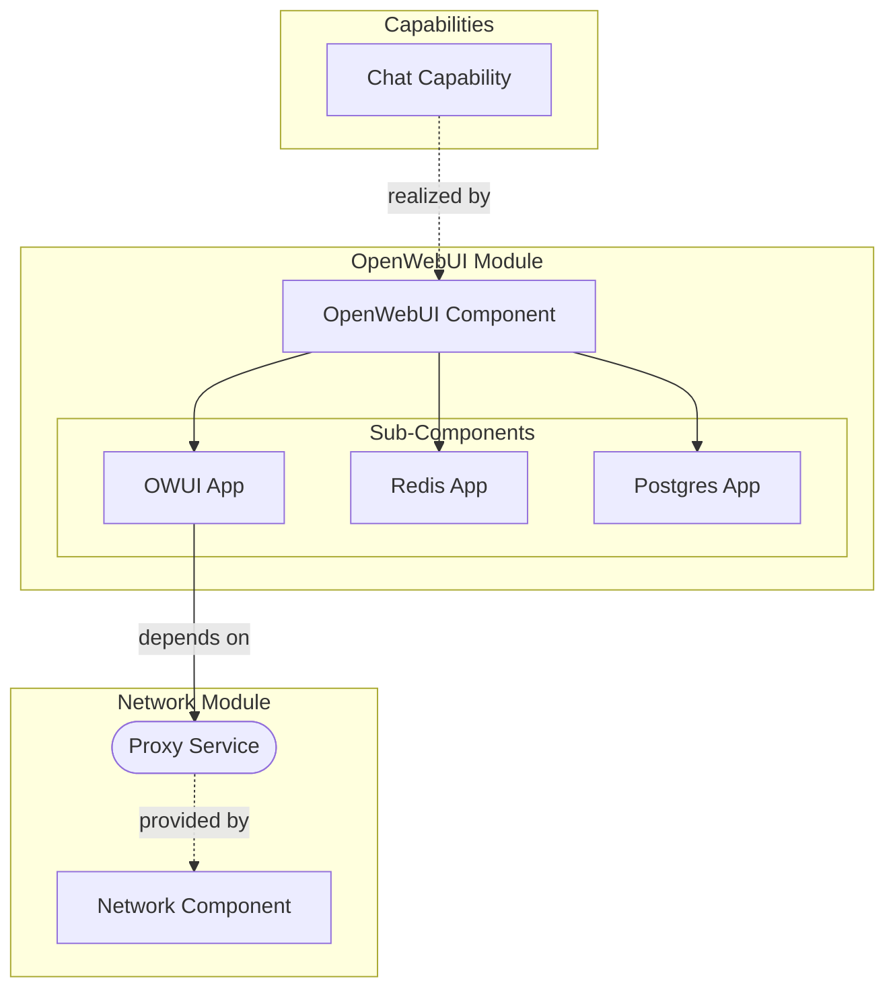

# Meta Model

The high-level architecture of TAPPaaS is modeled in a subset of ArchiMate. This page
is the reading guide for every architecture diagram on this site.

## ArchiMate Concepts We Use

- **Capability** — a high-level ability that the organization or system provides
- **Application Component** — a modular, deployable unit of software
- **Application Service** — a service exposed by an application component

We use **Capabilities** to describe what is being delivered, typically at the level
where a single general capability is delivered by one TAPPaaS module. Capabilities are
grouped into **Stacks** — containers of related capabilities. A capability is
delivered by a **TAPPaaS Module** — the smallest deployable unit. A module is modeled
as an Application Component; if it implements more than one open-source application,
we decompose it into sub-components. We model the coarse-grained **services** a module
delivers, and draw dependencies between modules by which services they consume.

## TAPPaaS → ArchiMate Concept Mapping

| TAPPaaS Concept | ArchiMate Element | Description |
|-----------------|-------------------|-------------|
| **Stack** | Capability | A TAPPaaS Stack (e.g., AI Stack, Productivity Stack) implements a business Capability |
| **Module** | Capability | A Module implements a more detailed Capability within a Stack |
| **Module Implementation** | Application Component | A Module is realized by one or more Application Components (the actual software) |
| **Service** | Application Service | A Module delivers Services that can be consumed by other modules or users |
| **VM** | Technology Node | Each module runs on a VM, modeled as a Technology Node |
| **Infrastructure Service** | Technology Service | Services like `cluster:vm`, `cluster:ha`, `network:proxy` are Technology Services |
| **User** | Business Actor | Platform users and administrators are Business Actors |
| **Proxmox Cluster** | Technology Node | The underlying virtualization infrastructure |
| **OPNsense Firewall** | Technology Node | Network security infrastructure |

### Relationship Patterns

| TAPPaaS Relationship | ArchiMate Relationship | Example |
|---------------------|------------------------|---------|
| Stack contains Modules | Aggregation | AI Stack aggregates OpenWebUI, LiteLLM, vLLM |
| Module realizes Capability | Realization | OpenWebUI module realizes "Chat Interface" capability |
| Module uses Service | Serving | OpenWebUI uses Identity service for authentication |
| Module depends on Module | Access | OpenWebUI accesses LiteLLM for model routing |
| VM hosts Application | Assignment | The VM is assigned to run the application |
| Infrastructure provides Service | Serving | Proxmox cluster serves VM provisioning |

## Example: OpenWebUI Module

The following diagram shows how the OpenWebUI module delivers a Chat capability:



In this example:

- The **Chat Capability** is realized by the OpenWebUI module
- **OpenWebUI** is decomposed into three sub-components: OWUI App, Redis, and Postgres
- The **OWUI App** depends on the **Proxy Service** delivered by the network module

## Platform Architecture Overview

The high-level view — users, applications, and infrastructure:

```kroki-plantuml
@startuml
!include <archimate/Archimate>

title TAPPaaS Platform Architecture Overview

' Business Actors
Business_Actor(user, "Platform User")
Business_Actor(admin, "Administrator")

' Application Components
Application_Component(openwebui, "OpenWebUI")
Application_Component(litellm, "LiteLLM")
Application_Component(nextcloud, "Nextcloud")
Application_Component(identity, "Identity Provider")

' Technology Nodes
Technology_Node(proxmox, "Proxmox Cluster")
Technology_Node(firewall, "OPNsense Firewall")

' Application Services
Application_Service(chatSvc, "Chat Service")
Application_Service(fileSvc, "File Service")
Application_Service(authSvc, "Auth Service")

' Components realize services
Rel_Realization(openwebui, chatSvc)
Rel_Realization(nextcloud, fileSvc)
Rel_Realization(identity, authSvc)

' Users access services
Rel_Serving(chatSvc, user)
Rel_Serving(fileSvc, user)

' Admin manages infrastructure
Rel_Access(admin, proxmox, "manages")

' Application dependencies
Rel_Serving(litellm, openwebui, "API")
Rel_Serving(authSvc, openwebui)
Rel_Serving(authSvc, nextcloud)

' Infrastructure relationships
Rel_Serving(firewall, proxmox, "protects")

@enduml
```

## Architecture Layers

- **Business layer** — the actors (platform users, administrators) and the services
  they consume (chat, files, workflows).
- **Strategy layer** — the capabilities, organized into stacks
  (see [Capabilities](capabilities.md)).
- **Application layer** — the components realizing the capabilities
  (see the module catalog under [Stacks](module-designs/index.md)).
- **Technology layer** — Proxmox virtualization, OPNsense firewall + Caddy reverse
  proxy, ZFS storage with replication.

---

*The stack-level ArchiMate views live on the [Stacks pages](module-designs/index.md);
drawing conventions for diagram authors are in `NOTATION.md` in the Documentation
repository (not published).*
