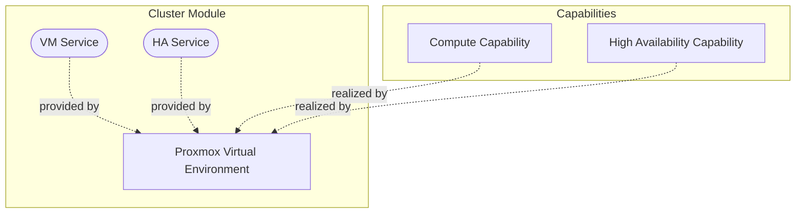
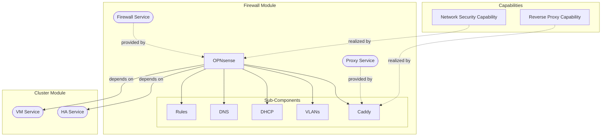

# Foundation Stack Modules

This page documents the module designs for the Foundation Stack components.

---

## Cluster Module

The Cluster module provides the core virtualization and high availability services.

### Design considerations

*To be documented.*

---

## Firewall Module

The Firewall module provides network security and reverse proxy services.

### Design considerations

*To be documented.*

---

## Identity Module

The Identity module provides authentication and access control services.

### Design considerations

*To be documented.*

---

## Backup Module

The Backup module provides automated backup services using Proxmox Backup Server.

### Design considerations

*To be documented.*

---

## CICD Module

The CICD module (tappaas-cicd) provides automation and deployment management.

### Design considerations

*To be documented.*
