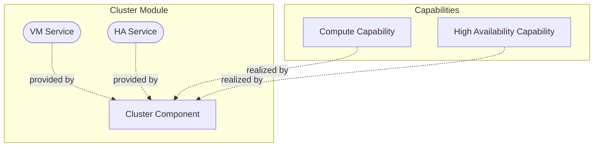
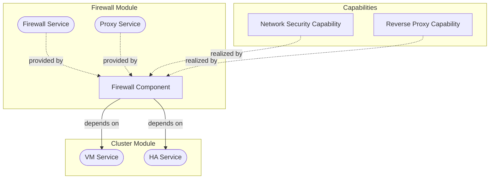
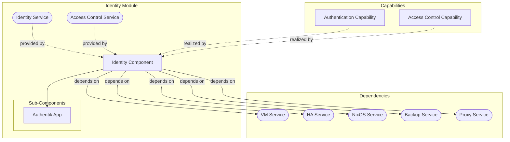
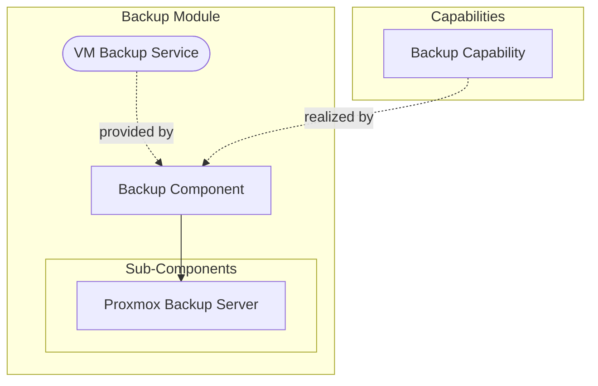
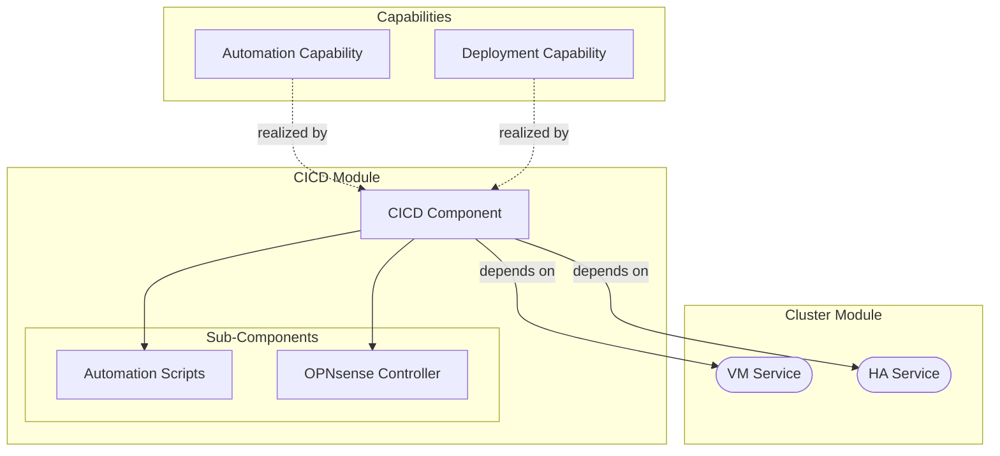

# Foundation Stack Modules

This page documents the module designs for the Foundation Stack components.

---

## Cluster Module

The Cluster module provides the core virtualization and high availability services.

| Attribute | Value |
|-----------|-------|
| **Provides** | vm, ha |
| **Depends On** | _(none)_ |
| **Consumed By** | firewall, tappaas-cicd, identity, litellm, openwebui, vaultwarden, netbird-client, unifi |

---

## Firewall Module

The Firewall module provides network security and reverse proxy services.

| Attribute | Value |
|-----------|-------|
| **Provides** | firewall, proxy |
| **Depends On** | cluster:vm, cluster:ha |
| **Consumed By** | identity, litellm, openwebui, vaultwarden, netbird-client |

---

## Identity Module

The Identity module provides authentication and access control services.

| Attribute | Value |
|-----------|-------|
| **Provides** | identity, accessControl |
| **Depends On** | cluster:vm, cluster:ha, templates:nixos, backup:vm, firewall:proxy |
| **Consumed By** | litellm, openwebui, vaultwarden, netbird-client |

---

## Backup Module

The Backup module provides automated backup services using Proxmox Backup Server.

| Attribute | Value |
|-----------|-------|
| **Provides** | vm |
| **Depends On** | _(none)_ |
| **Consumed By** | identity, litellm, openwebui, vaultwarden, netbird-client, unifi |

---

## CICD Module

The CICD module (tappaas-cicd) provides automation and deployment management.

| Attribute | Value |
|-----------|-------|
| **Provides** | _(none)_ |
| **Depends On** | cluster:vm, cluster:ha |
| **Consumed By** | _(orchestrates all modules)_ |
