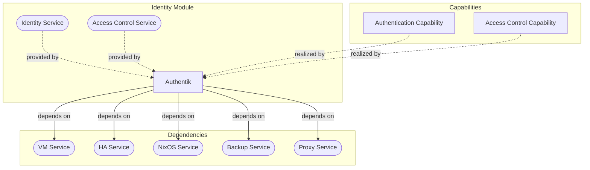
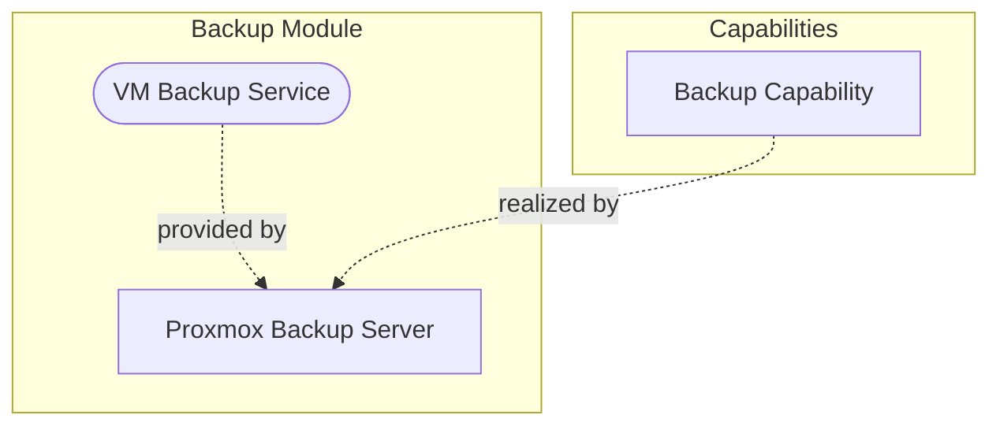

# Foundation Stack Modules

This page documents the module designs for the Foundation Stack components.

---

## Cluster Module

The Cluster module provides the core virtualization and high availability services.

### Design considerations

*To be documented.*

### Design details

*To be documented.*

---

## Firewall Module

The Firewall module provides network security and reverse proxy services.

### Design considerations

*To be documented.*

### Design details

#### Zones

Network segmentation in TAPPaaS is managed through **zones**, which define VLANs, IP ranges, DHCP settings, and firewall rules. The `opnsense-controller` from the CICD module configures OPNsense based on zone definitions.

**Zone Configuration (`zones.json`)**

Each zone is defined with the following key attributes:

| Field | Description |
|-------|-------------|
| `type` | Zone classification: Management, Service, Client, IoT, Guest, or DMZ |
| `state` | Activation state: Active, Mandatory, Inactive, Disabled, or Manual |
| `typeId` | Numeric identifier for zone type (0=Management, 2=Service, 3=Client, 4=IoT, 5=Guest, 6=DMZ) |
| `subId` | Unique number (0-99) within the zone type |
| `vlantag` | VLAN tag computed as `typeId * 100 + subId` (0 = untagged) |
| `ip` | IP range in CIDR notation, typically `10.typeId.subId.0/24` |
| `bridge` | Network interface (lan, wan, opt1, opt2) |
| `access-to` | List of zones this zone can connect to |
| `DHCP-start/end` | DHCP range offsets within the subnet |

**Standard Zones**

| Zone | Type | VLAN | IP Range | Purpose |
|------|------|------|----------|---------|
| mgmt | Management | 0 (untagged) | 10.0.0.0/24 | TAPPaaS nodes and self-management |
| srv | Service | 210 | 10.2.10.0/24 | TAPPaaS business services |
| private | Client | 310 | 10.3.10.0/24 | Regular user connections |
| iot | IoT | 410 | 10.4.10.0/24 | IoT device connections |
| dmz | DMZ | 610 | 10.6.0.0/24 | Internet-exposed services |

**Module Zone Assignment**

Modules specify their zone placement via fields in their `<module>.json`:

| Field | Description |
|-------|-------------|
| `zone0` | Security zone for the VM's first network interface (net0) |
| `zone1` | Security zone for the VM's second network interface (net1) |
| `trunks0` | Semicolon-separated list of additional zones to trunk on net0 |

The `zone-manager` component of `opnsense-controller` reads these configurations and automatically provisions VLANs, DHCP ranges, and firewall rules in OPNsense.

---

## Identity Module

The Identity module provides authentication and access control services.

### Design considerations

*To be documented.*

### Design details

*To be documented.*

---

## Backup Module

The Backup module provides automated backup services using Proxmox Backup Server.

### Design considerations

**PBS Deployment Architecture**

Three deployment options were evaluated for Proxmox Backup Server:

**Option A: PBS as VM on PVE Cluster Node**

- Assumes modern hardware with sufficient resources
- Maintains uniform node configuration
- PBS can be snapshotted and migrated
- Standard TAPPaaS node automation applies

**Option B: Bare Metal PBS**

- Dedicated hardware for backup (e.g., repurposed legacy servers)
- Requires `corosync-qdevice` package on all cluster nodes
- Adds dependency burden across cluster for minority use case

**Option C: PBS installed alongside PVE (Selected)**

PBS is installed on TAPPaaS PVE nodes in parallel with PVE, rather than as a VM or separate bare metal instance.

*Rationale:* This hybrid approach captures advantages from both options - uniform automation while avoiding VM overhead for backup-dedicated nodes.

*Trade-offs:*

- If a node is only used for backup, PVE adds overhead
- Resource visibility is split between PVE and PBS

### Design details

*To be documented.*

---

## CICD Module

The CICD module (tappaas-cicd) provides automation and deployment management.

### Design considerations

*To be documented.*

### Design details

*To be documented.*
