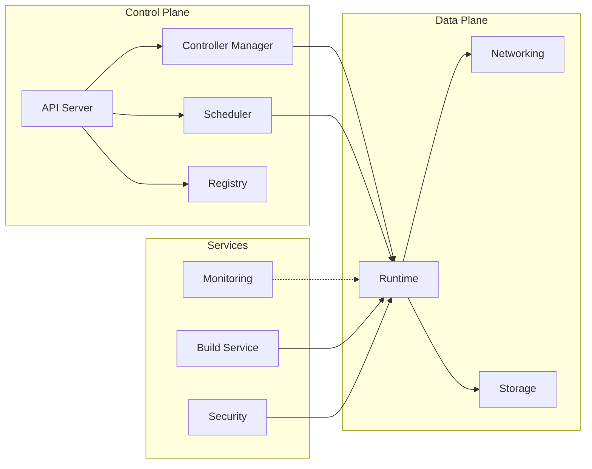
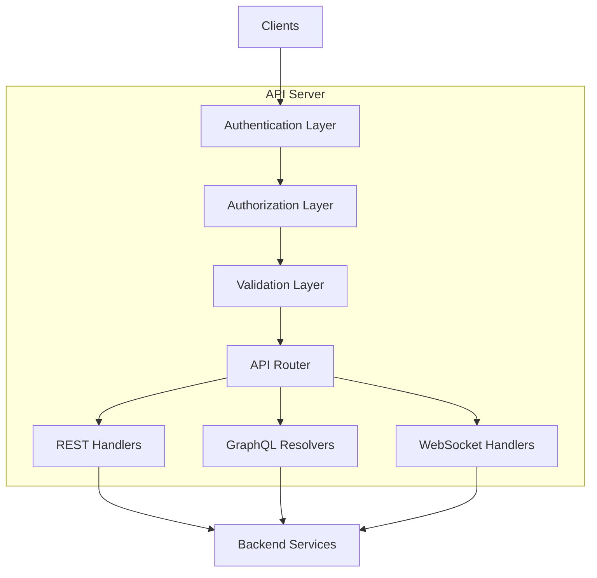
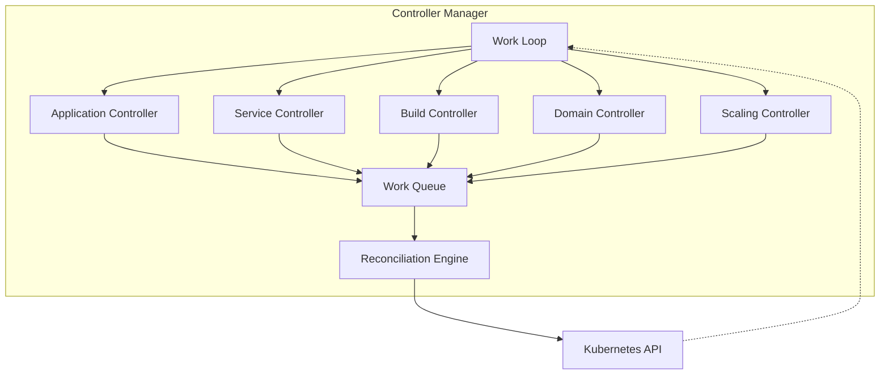
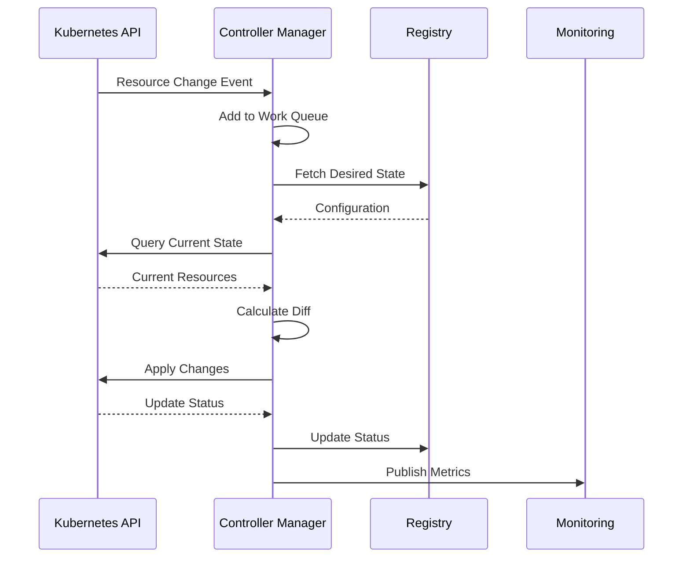
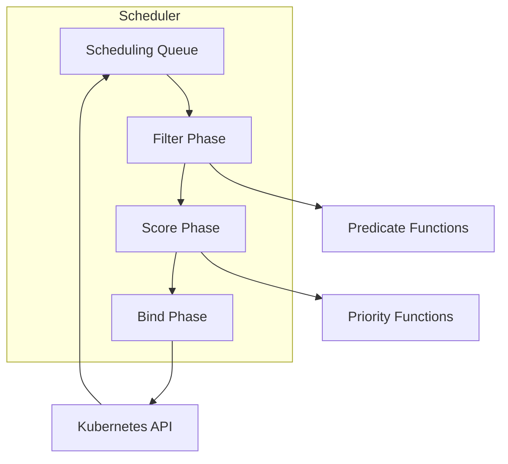
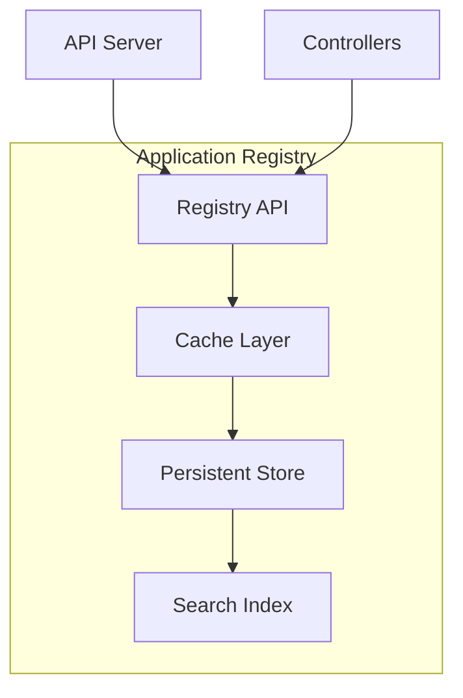
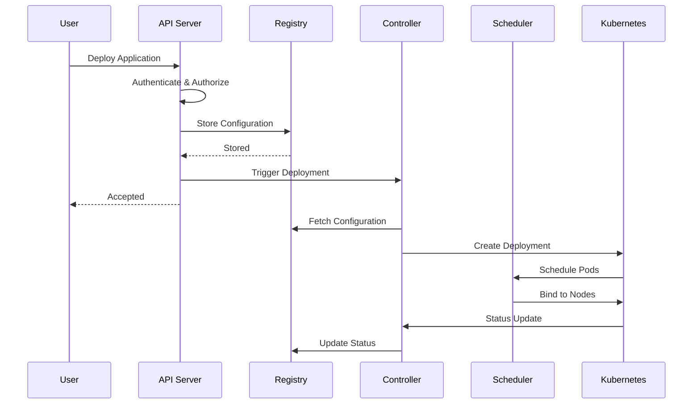

# Core Components

This page provides detailed documentation of all major components in the TAPPaaS platform. Understanding these components, their responsibilities, and how they interact is essential for platform operators, contributors, and advanced users.

## Component Overview

TAPPaaS components are organized into three main categories:

- **Control Plane Components**: Manage platform operations and application lifecycle
- **Data Plane Components**: Provide runtime infrastructure for applications
- **Platform Services**: Support observability, security, and build operations



---

## Control Plane Components

The control plane manages all platform operations and provides the interface for users to interact with TAPPaaS.

### API Server

The API Server is the central hub for all TAPPaaS operations, providing a unified interface for platform management.

#### Component Architecture



#### Responsibilities

| Responsibility | Description |
|----------------|-------------|
| Authentication | Verify user identity via tokens, OAuth2, or mutual TLS |
| Authorization | Enforce RBAC policies and resource access control |
| API Gateway | Route requests to appropriate backend services |
| Request Validation | Validate request schemas and parameters |
| Rate Limiting | Enforce quota and rate limits per user/tenant |
| Audit Logging | Record all API operations for compliance |
| API Versioning | Support multiple API versions simultaneously |

#### Configuration Options

**Basic Configuration:**

```yaml
apiServer:
  # Server binding configuration
  host: "0.0.0.0"
  port: 8443
  tlsEnabled: true
  tlsCertPath: "/etc/tappaas/tls/server.crt"
  tlsKeyPath: "/etc/tappaas/tls/server.key"

  # API features
  apiVersions:
    - "v1"
    - "v1beta1"
  graphqlEnabled: true
  websocketEnabled: true

  # Performance tuning
  maxConcurrentRequests: 1000
  requestTimeout: 30s
  keepAliveTimeout: 60s

  # Rate limiting
  rateLimit:
    enabled: true
    requestsPerMinute: 100
    burst: 200
```

**Advanced Configuration:**

```yaml
apiServer:
  # Authentication
  authentication:
    tokenAuth:
      enabled: true
      secretKey: "${TOKEN_SECRET}"
    oauth2:
      enabled: true
      provider: "keycloak"
      clientId: "${OAUTH_CLIENT_ID}"
      clientSecret: "${OAUTH_CLIENT_SECRET}"
      issuerUrl: "https://auth.example.com"
    mutualTLS:
      enabled: true
      caCertPath: "/etc/tappaas/tls/ca.crt"

  # Authorization
  authorization:
    rbacEnabled: true
    defaultRole: "viewer"
    adminGroups:
      - "platform-admins"

  # Audit logging
  audit:
    enabled: true
    logPath: "/var/log/tappaas/audit.log"
    logLevel: "info"
    includeSensitiveData: false
```

#### Interactions

- **Inbound**: Receives requests from CLI, Web UI, and external integrations
- **Outbound**: Communicates with Controller Manager, Scheduler, Registry, and Configuration Store
- **Events**: Publishes API operation events to monitoring system

---

### Controller Manager

The Controller Manager implements reconciliation loops to maintain desired state for all platform resources.

#### Component Architecture



#### Controllers

##### Application Controller

Manages the complete lifecycle of applications from creation to deletion.

**Responsibilities:**

- Create and update Kubernetes Deployments
- Manage application configuration and secrets
- Handle rollout strategies (rolling, blue-green, canary)
- Implement rollback functionality
- Monitor deployment health and status

**Configuration:**

```yaml
controllers:
  application:
    enabled: true
    workers: 10
    resyncPeriod: 5m
    reconcileTimeout: 10m

    # Deployment strategies
    strategies:
      default: "rolling"
      rolling:
        maxSurge: 25%
        maxUnavailable: 25%
      blueGreen:
        enabled: true
        previewTime: 5m
      canary:
        enabled: true
        steps:
          - weight: 10
            duration: 5m
          - weight: 50
            duration: 10m
          - weight: 100
```

##### Service Controller

Manages service discovery and routing configuration.

**Responsibilities:**

- Create Kubernetes Services
- Configure service mesh routing rules
- Manage load balancer configuration
- Handle service endpoint updates
- Implement service health checks

**Configuration:**

```yaml
controllers:
  service:
    enabled: true
    workers: 5

    # Service configuration
    defaultType: "ClusterIP"
    sessionAffinity: "None"
    loadBalancer:
      enabled: true
      provider: "metallb"

    # Service mesh integration
    serviceMesh:
      enabled: true
      provider: "istio"
      mtlsMode: "STRICT"
```

##### Build Controller

Orchestrates container image builds for applications.

**Responsibilities:**

- Trigger builds based on source code changes
- Manage build pipelines and stages
- Handle build artifacts and caching
- Publish container images to registry
- Report build status and logs

**Configuration:**

```yaml
controllers:
  build:
    enabled: true
    workers: 5

    # Build configuration
    builder:
      type: "buildpacks"  # or "dockerfile", "kaniko"
      cacheEnabled: true
      cacheSize: "10Gi"

    # Registry configuration
    registry:
      url: "registry.example.com"
      namespace: "tappaas-builds"
      credentials:
        secretName: "registry-credentials"

    # Build resources
    resources:
      cpu: "2"
      memory: "4Gi"
      timeout: "30m"
```

##### Domain Controller

Manages ingress configuration and TLS certificate provisioning.

**Responsibilities:**

- Create and update Ingress resources
- Request and renew TLS certificates
- Configure DNS records (via external-dns)
- Validate domain ownership
- Handle custom domain configuration

**Configuration:**

```yaml
controllers:
  domain:
    enabled: true
    workers: 3

    # Ingress configuration
    ingress:
      className: "nginx"
      annotations:
        cert-manager.io/cluster-issuer: "letsencrypt-prod"

    # TLS configuration
    tls:
      enabled: true
      certManager:
        enabled: true
        issuer: "letsencrypt-prod"
      autoRenew: true
      renewBefore: "720h"  # 30 days

    # DNS configuration
    dns:
      enabled: true
      provider: "route53"
      zone: "example.com"
```

##### Scaling Controller

Handles horizontal pod autoscaling based on metrics.

**Responsibilities:**

- Monitor application metrics
- Calculate required replica count
- Scale applications up or down
- Implement scaling policies and limits
- Handle scheduled scaling

**Configuration:**

```yaml
controllers:
  scaling:
    enabled: true
    workers: 5

    # Autoscaling configuration
    autoscaling:
      enabled: true
      defaultMetrics:
        - type: "cpu"
          target: 80
        - type: "memory"
          target: 80

      # Scaling behavior
      behavior:
        scaleUp:
          stabilizationWindow: 0s
          policies:
            - type: "Percent"
              value: 100
              periodSeconds: 15
        scaleDown:
          stabilizationWindow: 300s
          policies:
            - type: "Percent"
              value: 50
              periodSeconds: 60

    # Scheduled scaling
    scheduled:
      enabled: true
```

#### Component Interactions



---

### Application Scheduler

The Scheduler determines optimal placement of application workloads across cluster nodes.

#### Component Architecture



#### Scheduling Process

The scheduler uses a three-phase process to select optimal nodes:

1. **Filtering**: Eliminate nodes that don't meet requirements
2. **Scoring**: Rank remaining nodes by suitability
3. **Binding**: Assign pod to highest-scoring node

#### Responsibilities

| Phase | Responsibility |
|-------|----------------|
| Filtering | Remove nodes that lack required resources, labels, or capabilities |
| Scoring | Rank nodes based on resource availability, affinity, and policies |
| Binding | Create binding between pod and selected node |
| Preemption | Evict lower-priority pods if necessary |
| Monitoring | Track scheduling success rate and latency |

#### Configuration Options

```yaml
scheduler:
  enabled: true
  workers: 5

  # Scheduling policies
  policies:
    # Resource-based policies
    enableResourceFitPredicate: true
    enableNodeAffinityPredicate: true
    enablePodAffinityPredicate: true

    # Scoring weights
    nodeResourcesBalancedAllocation: 1
    nodeResourcesLeastAllocated: 1
    nodeAffinity: 1
    podTopologySpread: 2

  # Performance tuning
  schedulingQueueSize: 1000
  bindTimeout: 30s
  preemptionEnabled: true

  # Multi-tenancy
  namespaceIsolation: true
  quotaEnforcement: true
```

#### Scheduling Factors

**Resource Requirements:**

```yaml
# Example scheduling constraints
application:
  resources:
    requests:
      cpu: "500m"
      memory: "512Mi"
    limits:
      cpu: "2"
      memory: "2Gi"

  # Node selection
  nodeSelector:
    disktype: "ssd"
    gpu: "true"

  # Affinity rules
  affinity:
    nodeAffinity:
      requiredDuringSchedulingIgnoredDuringExecution:
        nodeSelectorTerms:
          - matchExpressions:
              - key: "zone"
                operator: "In"
                values: ["us-east-1a", "us-east-1b"]

    podAntiAffinity:
      preferredDuringSchedulingIgnoredDuringExecution:
        - weight: 100
          podAffinityTerm:
            labelSelector:
              matchLabels:
                app: "myapp"
            topologyKey: "kubernetes.io/hostname"
```

---

### Application Registry

The Registry maintains the catalog of applications and their metadata.

#### Component Architecture



#### Responsibilities

- Store application metadata and configuration
- Maintain version history
- Track deployment status and health
- Provide search and query capabilities
- Manage application relationships and dependencies

#### Data Model

```yaml
# Application record structure
Application:
  metadata:
    id: "app-12345"
    name: "my-application"
    namespace: "production"
    created: "2026-02-16T10:00:00Z"
    updated: "2026-02-16T15:30:00Z"
    labels:
      team: "platform"
      environment: "production"
    annotations:
      description: "Main web application"

  spec:
    source:
      type: "git"
      url: "https://github.com/example/app.git"
      branch: "main"

    build:
      type: "buildpacks"
      env:
        - name: "NODE_ENV"
          value: "production"

    runtime:
      replicas: 3
      resources:
        requests:
          cpu: "500m"
          memory: "512Mi"

    networking:
      ports:
        - name: "http"
          port: 8080
      domains:
        - "app.example.com"

  status:
    phase: "Running"
    conditions:
      - type: "Ready"
        status: "True"
        lastTransitionTime: "2026-02-16T15:30:00Z"
    replicas:
      desired: 3
      ready: 3
      available: 3
    observedGeneration: 5
```

#### Configuration

```yaml
registry:
  # Storage backend
  storage:
    type: "etcd"
    endpoints:
      - "etcd-1:2379"
      - "etcd-2:2379"
      - "etcd-3:2379"
    tlsEnabled: true
    prefix: "/tappaas/registry"

  # Caching
  cache:
    enabled: true
    type: "redis"
    endpoint: "redis:6379"
    ttl: "5m"

  # Search indexing
  search:
    enabled: true
    engine: "elasticsearch"
    endpoint: "http://elasticsearch:9200"
```

---

## Data Plane Components

The data plane provides the runtime environment where applications execute.

### Application Runtime

The runtime provides the execution environment for deployed applications.

#### Runtime Features

| Feature | Description |
|---------|-------------|
| Container Orchestration | Kubernetes-based pod management |
| Resource Isolation | CPU, memory, and I/O limits via cgroups |
| Security Context | User namespaces, capabilities, seccomp |
| Health Monitoring | Liveness, readiness, and startup probes |
| Environment Injection | Configuration, secrets, and service discovery |
| Volume Management | Persistent and ephemeral storage mounting |

#### Runtime Configuration

```yaml
runtime:
  # Container runtime
  containerRuntime: "containerd"
  runtimeClass: "default"

  # Security
  securityContext:
    runAsNonRoot: true
    runAsUser: 1000
    fsGroup: 1000
    seccompProfile:
      type: "RuntimeDefault"
    capabilities:
      drop:
        - "ALL"

  # Resource management
  resources:
    defaultRequests:
      cpu: "100m"
      memory: "128Mi"
    defaultLimits:
      cpu: "1"
      memory: "512Mi"

    # Quality of Service
    qosClass: "Burstable"

  # Health checks
  healthChecks:
    livenessProbe:
      httpGet:
        path: "/health"
        port: 8080
      initialDelaySeconds: 30
      periodSeconds: 10
      timeoutSeconds: 5
      failureThreshold: 3

    readinessProbe:
      httpGet:
        path: "/ready"
        port: 8080
      initialDelaySeconds: 10
      periodSeconds: 5
      timeoutSeconds: 3
      failureThreshold: 3
```

---

### Networking Components

The networking layer handles all application connectivity.

#### Ingress Controller

Manages external traffic routing to applications.

**Responsibilities:**

- HTTP/HTTPS traffic routing
- TLS termination
- Virtual host routing
- Path-based routing
- Load balancing across pods

**Configuration:**

```yaml
networking:
  ingress:
    controller: "nginx"
    className: "nginx"

    # Load balancing
    loadBalancing:
      algorithm: "round-robin"
      sessionAffinity: "cookie"

    # TLS configuration
    tls:
      defaultCert:
        secretName: "default-tls-cert"
      protocols:
        - "TLSv1.2"
        - "TLSv1.3"
      ciphers:
        - "ECDHE-ECDSA-AES128-GCM-SHA256"
        - "ECDHE-RSA-AES128-GCM-SHA256"
```

#### Service Mesh

Provides advanced networking features for inter-service communication.

**Features:**

- Mutual TLS (mTLS) encryption
- Traffic management and routing
- Circuit breaking and retries
- Observability and tracing
- Service-to-service authorization

**Configuration:**

```yaml
networking:
  serviceMesh:
    enabled: true
    provider: "istio"

    # mTLS configuration
    mtls:
      mode: "STRICT"
      autoRotation: true
      certTTL: "24h"

    # Traffic management
    trafficManagement:
      connectionPool:
        http:
          http1MaxPendingRequests: 1024
          http2MaxRequests: 1024
        tcp:
          maxConnections: 1024

      outlierDetection:
        consecutiveErrors: 5
        interval: "30s"
        baseEjectionTime: "30s"
```

---

### Storage Components

The storage layer provides persistent data storage.

#### Storage Classes

| Storage Class | Performance | Availability | Use Case |
|---------------|-------------|--------------|----------|
| fast-ssd | High IOPS, low latency | Zone-local | Databases |
| standard | Balanced | Zone-local | Application data |
| replicated | Moderate | Multi-zone | Critical data |
| archival | Low cost | Durable | Backups, logs |

#### Configuration

```yaml
storage:
  # Default storage class
  defaultClass: "standard"

  # Storage provisioners
  provisioners:
    - name: "fast-ssd"
      provisioner: "ebs.csi.aws.com"
      parameters:
        type: "gp3"
        iops: "3000"
        throughput: "125"

    - name: "standard"
      provisioner: "ebs.csi.aws.com"
      parameters:
        type: "gp3"

  # Volume snapshots
  snapshots:
    enabled: true
    retentionDays: 30
    schedule: "0 2 * * *"
```

---

## Platform Services

Platform services provide supporting capabilities for the control and data planes.

### Monitoring Service

Collects and aggregates metrics from all platform components and applications.

**Components:**

- Prometheus for metrics collection
- Grafana for visualization
- Alertmanager for alert routing

**Configuration:**

```yaml
monitoring:
  prometheus:
    enabled: true
    retention: "30d"
    scrapeInterval: "15s"

  alerting:
    enabled: true
    receivers:
      - name: "platform-team"
        email: "platform@example.com"
        slack: "#platform-alerts"
```

### Build Service

Manages container image builds for applications.

**Build Strategies:**

- Cloud Native Buildpacks
- Dockerfile builds
- Source-to-image (S2I)

**Configuration:**

```yaml
buildService:
  enabled: true

  builders:
    - name: "buildpacks"
      image: "paketobuildpacks/builder:base"
      default: true

    - name: "dockerfile"
      enabled: true
```

### Security Service

Provides security scanning, secrets management, and policy enforcement.

**Features:**

- Container image scanning
- Secrets encryption and rotation
- Network policy enforcement
- Security policy validation

**Configuration:**

```yaml
security:
  imageScanning:
    enabled: true
    scanner: "trivy"
    failOnCritical: true

  secretsManagement:
    provider: "vault"
    autoRotation: true
    rotationPeriod: "90d"
```

---

## Component Interactions

### Deployment Workflow



---

## Related Documentation

- [Architecture Overview](overview.md) - High-level architecture and design
- [Configuration Reference](/docs/configuration/) - Component configuration options
- [Operations Guide](/docs/operations/) - Running and maintaining components
- [API Reference](/docs/api/) - Programmatic component interaction
