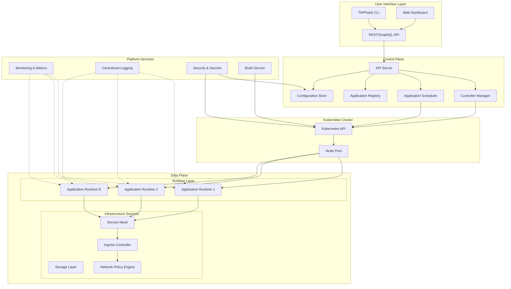
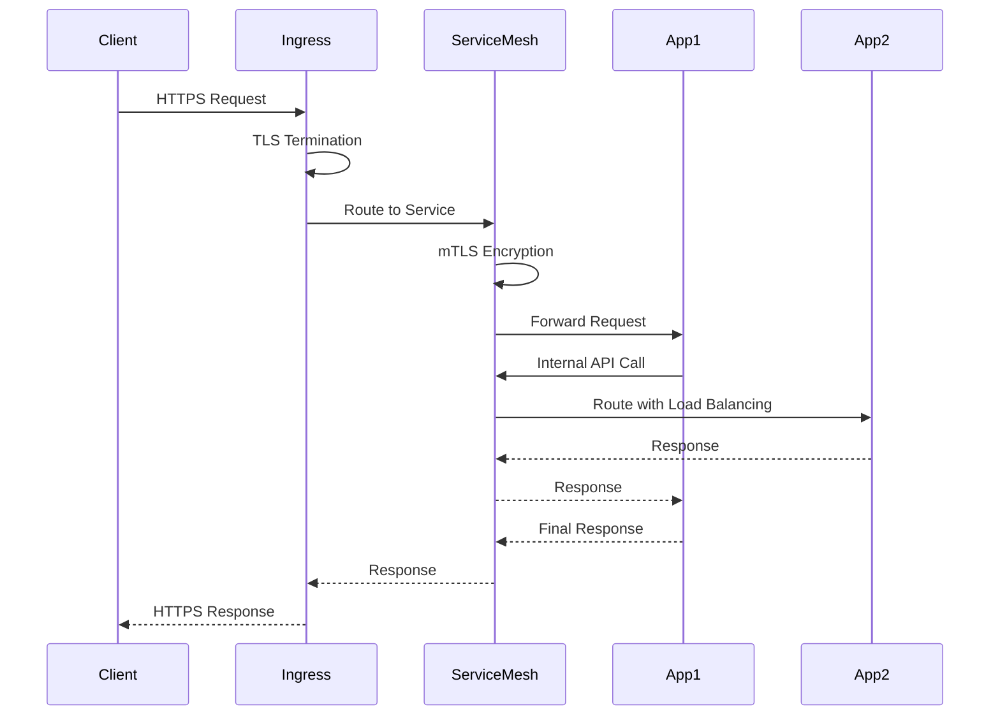
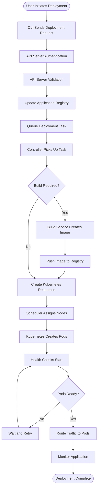

# Architecture Specification

This page provides a comprehensive overview of the TAPPaaS architecture, including system design, core components, communication patterns, and security considerations. TAPPaaS is designed as a cloud-native platform that simplifies application deployment on Kubernetes while maintaining flexibility and enterprise-grade capabilities.

## System Architecture

TAPPaaS follows a layered architecture pattern with clear separation between the control plane (platform management) and data plane (application runtime). The platform is built on Kubernetes and extends its capabilities with higher-level abstractions.



## Control Plane Components

The control plane is responsible for managing the platform lifecycle, application deployments, and orchestrating resources. It operates independently from application workloads to ensure platform stability.

### API Server

The API Server is the central entry point for all TAPPaaS operations and provides unified access to platform capabilities.

**Key Responsibilities:**

- Authentication and authorization of API requests
- Request validation and admission control
- REST and GraphQL API endpoints
- WebSocket support for real-time updates
- API versioning and backward compatibility

**Communication:**

- Receives requests from CLI, Web UI, and external integrations
- Interfaces with Controller Manager, Scheduler, and Registry
- Maintains connection to the Configuration Store

**Configuration:**

- Horizontal scaling supported for high availability
- TLS encryption for all API traffic
- Rate limiting and quota enforcement
- Audit logging of all operations

### Controller Manager

The Controller Manager implements the reconciliation loop pattern to ensure desired state matches actual state for all managed resources.

**Key Responsibilities:**

- Application lifecycle management (create, update, delete)
- Deployment orchestration and rollout strategies
- Health monitoring and self-healing
- Resource quota enforcement
- Event generation and status updates

**Controllers:**

| Controller | Purpose |
|------------|---------|
| Application Controller | Manages application deployments and lifecycle |
| Service Controller | Handles service discovery and routing configuration |
| Build Controller | Orchestrates container image builds |
| Domain Controller | Manages ingress and TLS certificate provisioning |
| Scaling Controller | Handles horizontal pod autoscaling |

**Communication:**

- Watches Kubernetes API for resource changes
- Updates Application Registry with deployment status
- Publishes events to monitoring and logging systems

### Application Scheduler

The Scheduler determines optimal placement of application workloads across the cluster based on resource requirements, constraints, and policies.

**Key Responsibilities:**

- Resource allocation and bin packing
- Affinity and anti-affinity rule enforcement
- Multi-tenancy isolation
- Node selection based on workload requirements
- Preemption and priority handling

**Scheduling Factors:**

- CPU and memory requirements
- Storage and network bandwidth needs
- Geographic and zone constraints
- Hardware capabilities (GPU, specialized processors)
- Cost optimization policies

### Application Registry

The Registry maintains the catalog of all applications, their configurations, and deployment history.

**Key Responsibilities:**

- Application metadata storage
- Version tracking and history
- Configuration management
- Deployment artifacts storage
- Application dependencies and relationships

**Data Model:**

```yaml
Application:
  - id: unique identifier
  - name: application name
  - namespace: tenant/project namespace
  - versions: list of application versions
  - configuration: current configuration
  - status: deployment status
  - metadata: labels, annotations, tags
```

### Configuration Store

The Configuration Store provides centralized, secure storage for platform and application configurations.

**Key Responsibilities:**

- Hierarchical configuration management
- Environment-specific overrides
- Secret encryption and access control
- Configuration versioning and rollback
- Configuration validation and schema enforcement

**Storage Backend:**

- etcd for high-performance key-value storage
- Encryption at rest for sensitive data
- Automatic backups and replication
- RBAC integration for access control

## Data Plane Components

The data plane is where application workloads run and includes all runtime infrastructure necessary to support deployed applications.

### Application Runtime

Each application runs within an isolated runtime environment with dedicated resources and security boundaries.

**Runtime Features:**

- Container orchestration via Kubernetes
- Resource limits and quotas enforcement
- Health checks and liveness probes
- Environment variable injection
- Volume mounting and persistent storage
- Network isolation and service mesh integration

**Runtime Types:**

| Runtime Type | Use Case |
|--------------|----------|
| Standard | General-purpose applications |
| High-Performance | CPU/memory intensive workloads |
| GPU-Enabled | Machine learning and graphics processing |
| Edge | Low-latency edge deployments |

### Networking Layer

The networking layer provides connectivity, service discovery, and traffic management for applications.

**Components:**

- **Ingress Controller**: External traffic routing and TLS termination
- **Service Mesh**: Inter-service communication, observability, and traffic control
- **Network Policies**: Microsegmentation and zero-trust networking
- **DNS Service Discovery**: Automatic service endpoint resolution

**Traffic Flow:**



### Storage Layer

The storage layer provides persistent data storage with various performance and durability characteristics.

**Storage Types:**

| Storage Class | Performance | Use Case |
|---------------|-------------|----------|
| Fast SSD | High IOPS, low latency | Databases, caches |
| Standard | Balanced performance | General application data |
| Archival | Low cost, high durability | Backups, logs, archives |
| Ephemeral | Temporary, node-local | Build caches, temp files |

**Features:**

- Volume snapshots and backups
- Volume expansion without downtime
- Cross-zone replication for HA
- Encryption at rest
- Storage quota management

## Communication Patterns

TAPPaaS uses several communication patterns optimized for different use cases.

### Synchronous Request-Response

Used for user-facing operations requiring immediate feedback.

**Pattern:**

- CLI/UI → API Server → Controller → Kubernetes API
- Response includes operation status and initial results
- Suitable for queries and simple operations

**Example Use Cases:**

- Fetching application status
- Listing deployed applications
- Retrieving logs and metrics
- Configuration queries

### Asynchronous Event-Driven

Used for long-running operations and state changes.

**Pattern:**

- Client initiates operation via API
- API Server creates work item and returns operation ID
- Controller processes work asynchronously
- Client polls or subscribes to status updates

**Example Use Cases:**

- Application deployments
- Scaling operations
- Build processes
- Backup and restore operations

### Watch/Subscribe

Used for real-time updates and monitoring.

**Pattern:**

- Client establishes WebSocket connection
- Server streams updates as events occur
- Client receives real-time notifications

**Example Use Cases:**

- Deployment progress tracking
- Real-time log streaming
- Metric and alert notifications
- Event monitoring

## Data Flow

Understanding data flow through the platform is essential for troubleshooting and optimization.

### Application Deployment Flow



### Configuration Update Flow

1. User updates configuration via CLI/UI
2. API Server validates configuration schema
3. Configuration Store persists new configuration
4. Controller detects configuration change
5. Controller triggers rolling update
6. Pods are recreated with new configuration
7. Health checks verify new pods
8. Old pods are terminated after successful deployment

### Monitoring Data Flow

1. Application emits metrics and logs
2. Metrics collected by Prometheus agents
3. Logs shipped to centralized logging system
4. Data indexed and stored
5. Dashboards query aggregated data
6. Alerts triggered based on rules
7. Notifications sent to configured channels

## Security Architecture

TAPPaaS implements defense-in-depth security with multiple layers of protection.

### Authentication and Authorization

**Authentication Methods:**

- API tokens for CLI and programmatic access
- OAuth2/OIDC for web UI single sign-on
- Mutual TLS for inter-component communication
- Kubernetes service accounts for workload identity

**Authorization Model:**

- Role-Based Access Control (RBAC)
- Attribute-Based Access Control (ABAC) for fine-grained policies
- Namespace-level isolation for multi-tenancy
- Resource quotas and limits enforcement

### Network Security

**Security Layers:**

| Layer | Security Measure |
|-------|------------------|
| Perimeter | Firewall, DDoS protection |
| Ingress | TLS termination, WAF |
| Service Mesh | mTLS, encryption in transit |
| Network Policy | Microsegmentation, zero-trust |
| Pod Security | Security contexts, AppArmor/SELinux |

### Secrets Management

**Features:**

- Encrypted storage in etcd
- Automatic secret rotation
- Integration with external secret managers (Vault, AWS Secrets Manager)
- Secret access auditing
- Fine-grained RBAC for secret access

### Compliance and Auditing

**Capabilities:**

- Comprehensive audit logging
- Immutable audit trail
- Compliance reporting (SOC2, HIPAA, PCI-DSS)
- Policy enforcement and validation
- Security scanning and vulnerability detection

## High Availability

TAPPaaS is designed for production deployments with high availability requirements.

### Control Plane HA

- Multiple API Server replicas with load balancing
- Etcd cluster with minimum 3 nodes
- Controller Manager leader election
- Automatic failover for failed components

### Data Plane HA

- Multi-zone application deployment
- Pod anti-affinity rules
- Automatic pod rescheduling on node failure
- Health-based traffic routing
- Persistent volume replication

### Disaster Recovery

- Regular etcd backups
- Application configuration snapshots
- Cross-region backup replication
- Documented recovery procedures
- Tested disaster recovery runbooks

## Performance and Scalability

TAPPaaS is designed to scale from small development clusters to large enterprise deployments.

### Scaling Dimensions

| Dimension | Scale Target |
|-----------|--------------|
| Applications | 10,000+ per cluster |
| Concurrent Deployments | 100+ simultaneous |
| API Throughput | 10,000+ requests/second |
| Nodes | 1,000+ worker nodes |
| Namespaces/Tenants | 1,000+ isolated environments |

### Optimization Strategies

- Horizontal scaling of control plane components
- Caching at multiple layers
- Efficient resource bin packing
- Connection pooling and reuse
- Asynchronous processing for long operations

## Related Documentation

- [Core Components](components.md) - Detailed component specifications
- [Deployment Models](/docs/architecture/deployment-models) - Architecture deployment patterns
- [Security Model](/docs/architecture/security) - Comprehensive security documentation
- [Configuration Reference](/docs/configuration/) - Platform configuration options
- [Operations Guide](/docs/operations/) - Production operations procedures
