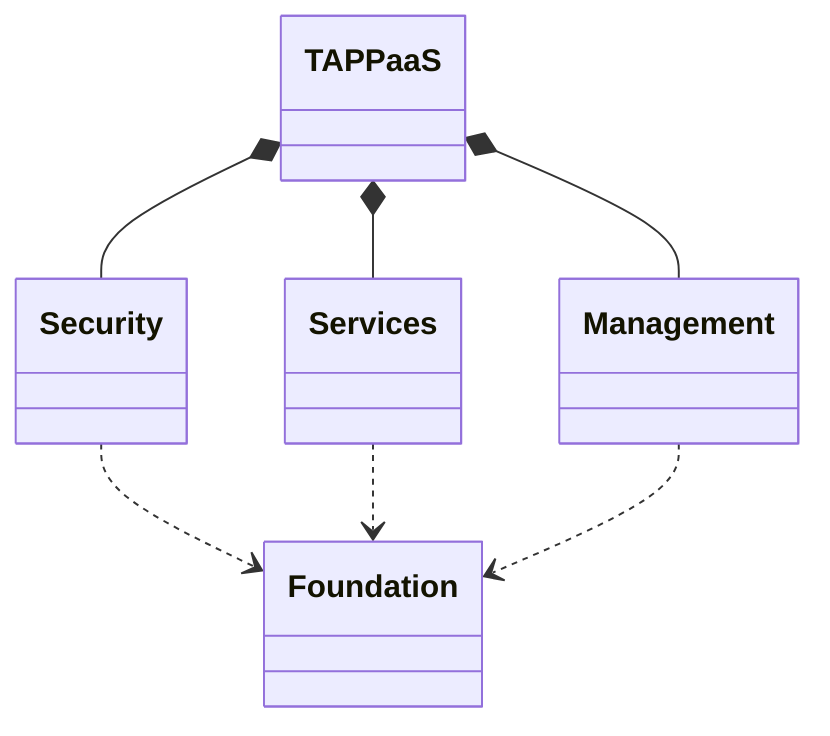

# Capabilities

## Overview

TAPPaaS represents a comprehensive IT solution designed through both top-down analysis of user needs and bottom-up examination of practical implementations. The framework aims to deliver capabilities described in supporting documentation while remaining grounded in real-world feasibility.

---

## High-Level Structure

The system organizes around four interdependent domains:

- **Security** - Protecting the platform and user data
- **Services** - The applications and functionality users interact with
- **Management** - Administration and maintenance capabilities
- **Foundation** - Essential infrastructure supporting all other components

Foundation provides the base infrastructure that Security and Services layers depend upon.

---

## Services

Services constitute the central value proposition. All the other parts like Foundation, Management and Security exist to ensure that you can get the IT you need working in a stable, scalable, integrated, secure, private and maintainable way.

Configuration varies by deployment type, with initial design targeting small businesses and home users.

### Home Deployment Services

**Physical Property Functions:**

- Smart lighting, heating, and irrigation systems
- Weather monitoring and intelligent home management

**Household Member Functions:**

- Email and contact management with personal ownership
- Calendar and note-taking with sharing capabilities
- Photo, music, video, and podcast libraries
- Document storage with privacy controls
- Personal AI assistance and e-book collection

### Extended Deployment Models

**Small Communities** add:

- Internet resource pooling
- Local information repositories (offline Wikipedia access)
- Social platforms
- Video conferencing

**Small Businesses** require:

- Corporate communications
- Office productivity suites with Microsoft compatibility
- Web presence
- Enterprise resource planning
- Dedicated networking infrastructure

**Development Organizations** need:

- Version control
- Continuous integration systems
- Application hosting platforms

**Specialized Deployments** (utilities, NGOs) emphasize:

- Firewall robustness
- Network segmentation
- Privacy protection
- Offline functionality
