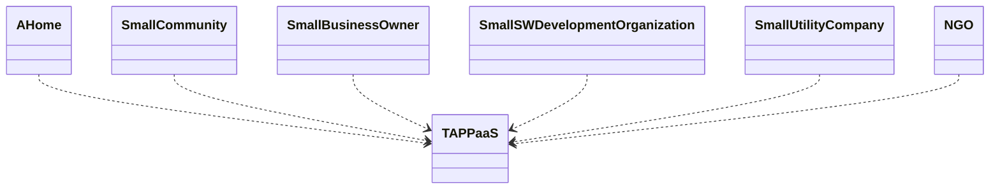

# Capabilities

## Overview

TAPPaaS represents a comprehensive IT solution designed through both top-down analysis of user needs and bottom-up examination of practical implementations. The framework aims to deliver capabilities described in supporting documentation while remaining grounded in real-world feasibility.

---

## High-Level Structure

The system organizes around four interdependent domains:

- **Security** - Protecting the platform and user data
- **Services** - The applications and functionality users interact with
- **Management** - Administration and maintenance capabilities
- **Foundation** - Essential infrastructure supporting all other components

Foundation provides the base infrastructure that Security and Services layers depend upon.

---

## Services

Services is what this is all about: Providing IT functions to the users of TAPPaaS. all the other parts like Foundation, Management and Security is just there to ensure that you can get the IT you need working in a stable, scalable, integrated, secure, private and maintainable way.

What services are essential to each deployment of TAPPaaS will differ, but we define a set of services that TAPPaaS should support based on the typical deployment. You can configure what is relevant for you deployment.

These examples of deployments are just examples, where we try and highlight the essential functionality that you need for that kind of deployment. 

Note we are using the word "small" a lot. Make no mistake, TAPPaaS as a core architecture can scale up, but our initial design criteria is to cater for the SMB/Home out of the box.

