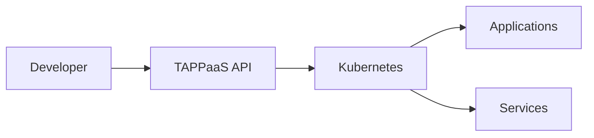

# Documentation

Welcome to the TAPPaaS documentation. Here you'll find comprehensive guides and references for all TAPPaaS features.

## Core Concepts

- **Applications** - Deploy and manage your applications
- **Services** - Connect databases, caches, and other services
- **Domains** - Configure custom domains and TLS
- **Scaling** - Auto-scaling and resource management

## Architecture

TAPPaaS is built on Kubernetes and provides a simplified interface for deploying cloud-native applications.

## Documentation Sections

| Section | Description |
|---------|-------------|
| [Getting Started](../getting-started/index.md) | Installation and first steps |
| [Community](../community/contributing.md) | Contributing and support |
| [About](../about/index.md) | Project information |

## Need Help?

- Check the [FAQ](#) for common questions
- Join our [community](../community/contributing.md)
- Report issues on [GitHub](https://github.com/TAPPaaS/Documentation/issues)
