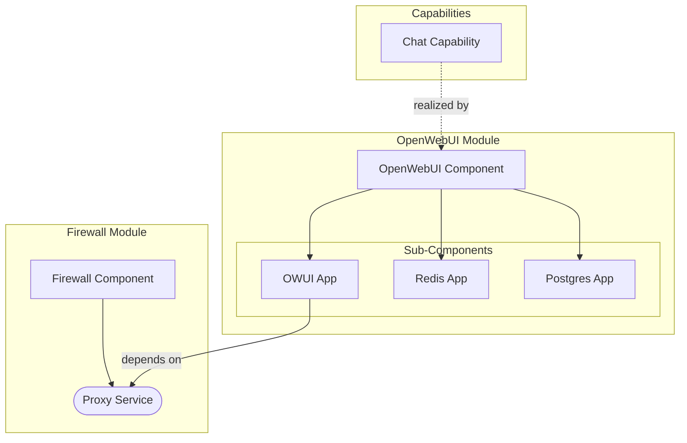

# Meta Model

The high level architecture of TAPPaaS is modeled in a subset of ArchiMate.

## ArchiMate Concepts

We use the following concepts from ArchiMate:

- **Capability** - A high-level ability that the organization or system provides
- **Application Component** - A modular, deployable unit of software
- **Application Service** - A service exposed by an application component

## How TAPPaaS Uses These Concepts

In TAPPaaS we use **Capabilities** to describe what is being delivered, typically at the level where a single general capability is delivered by one TAPPaaS module.

A **TAPPaaS module** is modeled as an Application Component. If a module implements more than one open source application, we decompose the application component into sub-components.

We model the coarse-grained **services** that a module delivers, and we create a dependency diagram between modules by indicating which services from other modules a given module depends on.

## Example: OpenWebUI Module

The following diagram shows how the OpenWebUI module delivers a Chat capability:

In this example:

- The **Chat Capability** is realized by the OpenWebUI module
- **OpenWebUI** is decomposed into three sub-components: OWUI App, Redis, and Postgres
- The **OWUI App** depends on the **Proxy Service** delivered by the Firewall module
