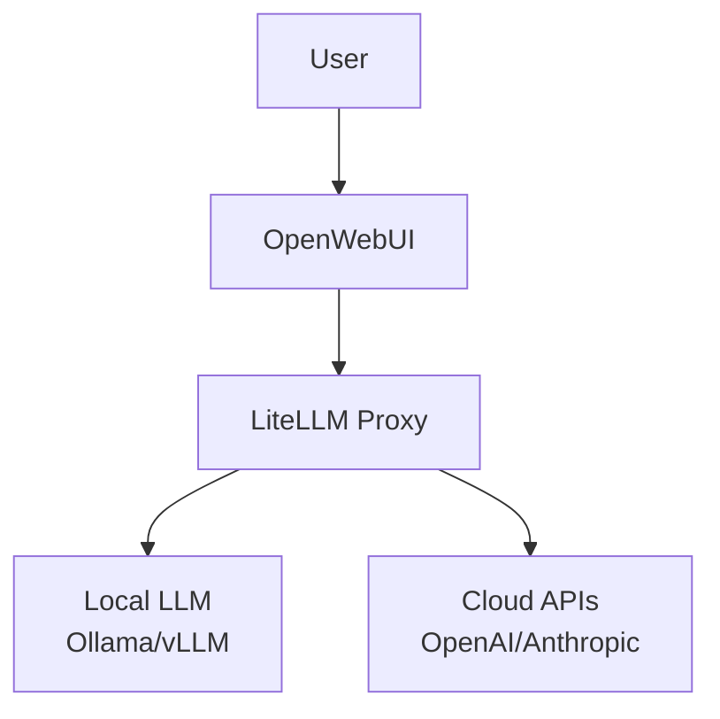

# AI Stack

The TAPPaaS AI Stack provides local AI capabilities, giving you control over your AI infrastructure while maintaining privacy and reducing costs.

## Components

| Component | Purpose |
|-----------|---------|
| **OpenWebUI** | Web interface for interacting with LLMs |
| **LiteLLM** | Unified API gateway for multiple LLM providers |
| **Ollama/vLLM** | Local LLM serving engines |

## Architecture

## Prerequisites

- [ ] [Foundation](../foundation/index.md) installed
- [ ] Sufficient RAM (minimum 8GB for AI workloads)
- [ ] GPU recommended for local LLM inference

## Hardware Requirements

| Configuration | RAM | GPU | Use Case |
|---------------|-----|-----|----------|
| Minimal | 8 GB | None | API proxy only |
| Standard | 16 GB | Optional | Small models (7B) |
| Performance | 32+ GB | Recommended | Large models (13B+) |

## Quick Start

For a basic AI setup:

1. Deploy [LiteLLM](litellm.md) as your API gateway
2. Configure cloud provider API keys
3. Deploy [OpenWebUI](openwebui.md) for user interface
4. Optionally add local LLM with [Ollama](ollama.md)

## Stack Options

### Cloud-Only Setup

Use LiteLLM as a proxy to cloud providers:

- Low resource requirements
- Access to latest models
- Pay-per-use pricing
- Requires internet connectivity

### Hybrid Setup

Combine local and cloud models:

- Use local models for common tasks
- Fall back to cloud for complex queries
- Balance cost and capability

### Fully Local

Run everything on-premises:

- Complete data privacy
- No ongoing API costs
- Requires significant hardware
- Limited to available open models

## Installation Guides

-   :material-api: **[LiteLLM](litellm.md)**

    ---

    Unified API gateway for managing multiple LLM providers

-   :material-chat: **[OpenWebUI](openwebui.md)**

    ---

    Feature-rich web interface for AI interactions

-   :material-cube: **[Ollama](ollama.md)**

    ---

    Easy local LLM deployment and management

## Cost Considerations

### Cloud API Costs

| Provider | Model | Approximate Cost |
|----------|-------|------------------|
| OpenAI | GPT-4 | $0.03/1K tokens |
| Anthropic | Claude 3 | $0.015/1K tokens |
| OpenRouter | Various | Varies |

### Self-Hosted Costs

| Component | Monthly Cost |
|-----------|--------------|
| Electricity | €20-50 |
| Hardware amortization | €30-100 |
| Internet | Existing |

## Security Notes

- API keys are stored securely in LiteLLM
- Local inference keeps data on-premises
- OpenWebUI supports user authentication
- Consider network isolation for AI workloads
