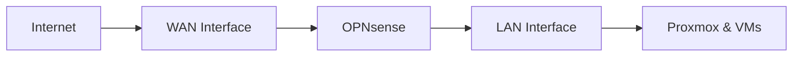

# Firewall Setup

This guide covers installing OPNsense as the firewall for your TAPPaaS environment on Proxmox infrastructure.

## Prerequisites

Before starting:

- [ ] [Proxmox Node](proxmox-node.md) installed and accessible
- [ ] Registered domain name
- [ ] Public IP address
- [ ] DNS management access
- [ ] Ports 80 and 443 available externally

## Overview

The installation follows five main phases:

1. Environment preparation
2. OPNsense deployment
3. Network reconfiguration
4. Firewall activation
5. Validation

## Network Architecture

The firewall VM requires two virtual network interfaces:

| Interface | Bridge | Purpose |
|-----------|--------|---------|
| WAN | vmbr0 (later renamed "wan") | Internet connectivity |
| LAN | vmbr1 (created as "lan") | Internal network |



## Installation

### Create Network Bridges

Before creating the OPNsense VM, set up the network bridges.

**Create LAN bridge:**

1. Navigate to **tappaas1** → **Network**
2. Click **Create** → **Linux Bridge**
3. Configure:
   - Name: `vmbr1`
   - Comment: `lan`
   - Bridge ports: (leave empty for now)

### Deploy OPNsense VM

Execute the automated deployment script:

```bash
REPO="https://raw.githubusercontent.com/TAPPaaS/TAPPaaS/"
BRANCH="main"
curl -fsSL ${REPO}${BRANCH}/src/foundation/10-firewall/install.sh | bash
```

### Initial OPNsense Configuration

Access the OPNsense console through Proxmox:

1. Open the VM console in Proxmox
2. Login with default credentials:
   - Username: `root`
   - Password: `opnsense`
3. **Immediately change the root password**

### Configure Network Interfaces

From the OPNsense console menu:

1. **Assign interfaces** (option 1)
   - WAN: `vtnet0`
   - LAN: `vtnet1`

2. **Set LAN IP** (option 2)
   - IP Address: `10.0.0.1`
   - Subnet mask: `24`
   - Enable DHCP: Yes
   - DHCP range: `10.0.0.100` to `10.0.0.254`

### Enable DNS Services

From the OPNsense web interface (`https://10.0.0.1`):

1. Navigate to **Services** → **Unbound DNS**
2. Enable DNS Resolver
3. Configure DNS settings as needed

## Network Migration

After successful OPNsense testing, migrate Proxmox to use the LAN interface.

### Update Proxmox Network

Edit `/etc/network/interfaces` on the Proxmox host:

```bash
# Change management IP to LAN network
auto vmbr1
iface vmbr1 inet static
    address 10.0.0.10/24
    gateway 10.0.0.1
    bridge-ports eth0
    bridge-stp off
    bridge-fd 0
```

### Rename Bridges

Rename the bridges for clarity:

1. Rename `vmbr0` to `wan`
2. Rename `vmbr1` to `lan`

Reboot the Proxmox host to apply changes.

## Firewall Switchover Options

Choose one of three scenarios:

### Option 1: Port Forwarding

Keep your existing ISP router/firewall and configure port forwarding:

- Forward ports 80, 443 to OPNsense WAN IP
- Suitable for testing or when you can't modify ISP equipment

### Option 2: Bridge Mode

Configure your ISP router to bridge mode:

- ISP router passes public IP directly to OPNsense
- OPNsense handles all routing and firewall functions

### Option 3: Direct Connection

Replace ISP router entirely:

- Connect OPNsense WAN directly to ISP modem
- Full control over network configuration

## DNS Configuration

Register your services in OPNsense DNS:

1. Navigate to **Services** → **Unbound DNS** → **Host Overrides**
2. Add entries for internal services:

| Host | Domain | IP |
|------|--------|-----|
| tappaas1 | mgmt.internal | 10.0.0.10 |
| opnsense | mgmt.internal | 10.0.0.1 |

## Verification

Test your firewall configuration:

```bash
# From a LAN client
ping 10.0.0.1        # OPNsense LAN
ping 10.0.0.10       # Proxmox
ping 8.8.8.8         # Internet
nslookup tappaas1.mgmt.internal
```

## Next Steps

With the firewall configured, proceed to [Additional Nodes](additional-nodes.md) if expanding your cluster, or continue to [NixOS Template](nixos-template.md).
