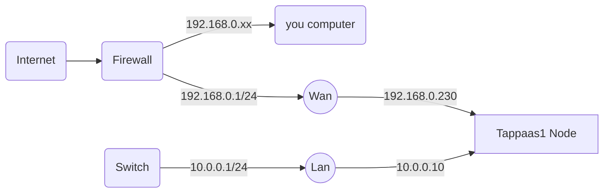
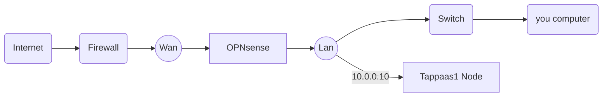

# Firewall Setup

This guide covers installing OPNsense as the firewall for your TAPPaaS environment on Proxmox infrastructure.

## Prerequisites

Before starting:

- [ ] [Cluster](cluster.md) installed and accessible
- [ ] Registered domain name
- [ ] Public IP address
- [ ] DNS management access
- [ ] Ports 80 and 443 available externally

## Overview

The installation follows five main phases:

1. Environment preparation
2. OPNsense deployment
3. Network reconfiguration
4. Firewall activation
5. Validation

## Network Architecture

The firewall VM requires two virtual network interfaces:

| Interface | Bridge | Purpose |
|-----------|--------|---------|
| WAN | vmbr0 (later renamed "wan") | Internet connectivity |
| LAN | vmbr1 (created as "lan") | Internal network |

## Installation

### Create Network Bridges

Before creating the OPNsense VM, set up the network bridges.

**Create LAN bridge:**

In the Proxmox GUI do:

1. go to node: tappaas1, select the Network page under system
    take note of the free ethernet ports, and select the one that will be the new lan port. note down the Name
2. click "create" select "linux bridge": in the pop up fill in
   -     Name: lan
   -     IPv4/CIDR: 10.0.0.10/24
   -     Gateway:blank (as we have a gateway on the other bridge)
   -     ipv6 and ipv6 gateway: leave blank
   -     Autostart is checked
   -     VLAN aware is checked
   -     Bridgeport: the name of the chosen ethernet port
   - now click create and click "apply configuration"

** Rename the vmbr0 bridge to "wan" **

1. using the command line/console of tappaas1:

 -   edit the /etc/network/interfaces
 -   replace all occurrences of "vmbr0" with the string "wan" (there should be two instances)
 -   save file

reboot the tappaas1 node (or PVE will not discover the new wan correctly)

attach a new switch to the ethernet port associated with the lan bridge port

you will now have a setup looking like this:


```mermaid
graph LR;
    I(Internet)-->F(Firewall)
    F -- 192.168.0.xx -->C(you computer);
    F -- 192.168.0.1/24 -->W((Wan));
    S(Switch)-- 10.0.0.1/24 --> L((Lan));
    W -- 192.168.0.230--> Pr[Tappaas1 Node];
    L -- 10.0.0.10 --> Pr
```


### Deploy OPNsense VM

**Create the OPNSense VM**: from the command prompt/console of tappaas1: (Note if you are not using the main branch then replace "main" with branch name in the command below)

```bash
REPO="https://raw.githubusercontent.com/TAPPaaS/TAPPaaS/"
BRANCH="main"
curl -fsSL  ${REPO}${BRANCH}/src/foundation/firewall/firewall.json > /root/tappaas/firewall.json
~/tappaas/Create-TAPPaaS-VM.sh firewall
```

once the script finish the 110 Firewall VM on tappaas1 will start booting
in the console of the VM you can login after boot as root with password opnsense

change the root password; option 3, followed by answer "y"

change lan ip; option 2:

- followed by 1 for Lan, and N for not using DHCP
- use ip 10.0.0.1,
- range: 24
- Press enter for LAN
- no IPv6 config (TODO, enable IPv6)
- enable DHCP, with a range of 10.0.0.100 - 10.0.0.254
- default "N" answers to the rest

- now reboot option 6

### Test

jump into a shell (option 8) and test that you can ping external addresses
(you might need to reboot opnsense for routing to work)

connect a pc to the LAN port of the proxmox box (can be via a switch)

- check that you get an ip in the 10.0.0.x range
- connect to the management console of opnsense: 10.0.0.1

## DNS setup

From: [OPNsense DHCP with DNS](https://docs.opnsense.org/manual/dnsmasq.html#dhcpv4-with-dns-registration)

Log into OPNsense on 10.0.0.1 (from the pc connected to the lan port)

Abort the configuration wizard if it starts up.

- Enable services -> Unbound DNS -> General and ensure it listen to port 53
- Enable services -> dnsmask DNS -> General
  - Interface LAN
  - Listen port: use port 53053
  - DNS Query Forwarding
    - enable: Require domain, Do not forward to system ..., Do not forward private reverse ...
  - DHCP:
    - enable: DHCP fqdn, DHCP authoritative, DHCP register firewall rules
    - DHCP default domain: internal
  - Click Apply
- Service -> Unbound DNS -> Query Forwarding
  - register (presse the "plus") "internal" to query 127.0.0.1 port 53053
  - register "10.in-addr.arpa" to query 127.0.0.1 port 53053
  - press apply
- go to Services -> Dnsmasq & DHCP -> DHCP ranges
  - edit LAN interface and change domain to mgmt.internal
  - press apply

Make untagged LAN trafic belong to domain mgmt.internal

- Enable services -> dnsmask DNS -> DHCP ranges
  - Edit Interface: LAN
  - add domain: mgmt.internal
  - press Save and then Apply

Register the static hosts on the internal network: firewall and tappaas1

- go to Service -> Dnsmasq DNS & DHCP -> Hosts
  - add host:
    - name firewall
    - domain: mgmt.internal
    - ip: 10.0.0.1
  - add host:
    - name tappaas1
    - domain: mgmt.internal
    - ip: 10.0.0.10
  - press apply

If you plan to add further nodes to the cluster then add tappaas2, tapppaas3, ... (incrementing the ip by one for each)

Check that you can lookup you your tappaas1 and firewall hosts using .mgmt.internal domain

## Swap cables Step

First we switch tappaas1 node to be working **only** on the Lan port:

- Note that you should connect to tappaas1 proxmox node via 10.0.0.10:8006
- in the Proxmox console for tappaas1 edit the network bridge "Wan": remove the IP assignment.
  - first remove both the IP and gateway assignment by editing the "wan" bridge under network for tappaas1
  - then add 10.0.0.1 as gateway for the "lan" bridge
  - press apply
- in the console fo the tappaas1 node (via the proxmox gui): edit the following files:
  - /etc/hosts: edit the host IP is the new 10.0.0.10
  - /etc/resolv.conf: update the resolver to 10.0.0.1
  - /etc/pve/corosync.conf: the old IP number to be replaced with 10.0.0.10

You should now have a setup looking like:


```mermaid
graph LR;
    I(Internet)-->F(Firewall)
    S-->C(you computer);
    F-->W((Wan));
    L((Lan)) --> S(Switch);
    O[OPNsense] --> L
    L -- 10.0.0.10 --> Pr[Tappaas1 Node];
    W --> O
```

(where OPNsense is a VM on the tappaas1 node)

reboot tappaas1 node and see that you have access to the internet from both the pc connected to the LAN switch and from the proxmox console. ensure you have access to the OPNsense GUI at 10.0.0.1

## Firewall Switchover Options

Choose one of three scenarios:

### Option 1: Port Forwarding

Keep your existing ISP router/firewall and configure port forwarding:

- Forward ports 80, 443 to OPNsense WAN IP
- Suitable for testing or when you can't modify ISP equipment

### Option 2: Bridge Mode

Configure your ISP router to bridge mode:

- ISP router passes public IP directly to OPNsense
- OPNsense handles all routing and firewall functions

### Option 3: Direct Connection

Replace ISP router entirely:

- Connect OPNsense WAN directly to ISP modem
- Full control over network configuration


## Verification

Test your firewall configuration:

```bash
# From a LAN client
ping 10.0.0.1        # OPNsense LAN
ping 10.0.0.10       # Proxmox
ping 8.8.8.8         # Internet
nslookup tappaas1.mgmt.internal
```

## Next Steps

With the firewall configured, proceed to [Expanding Cluster](expanding-cluster.md) if expanding your cluster, or continue to [VM Templates](vm-templates.md).
