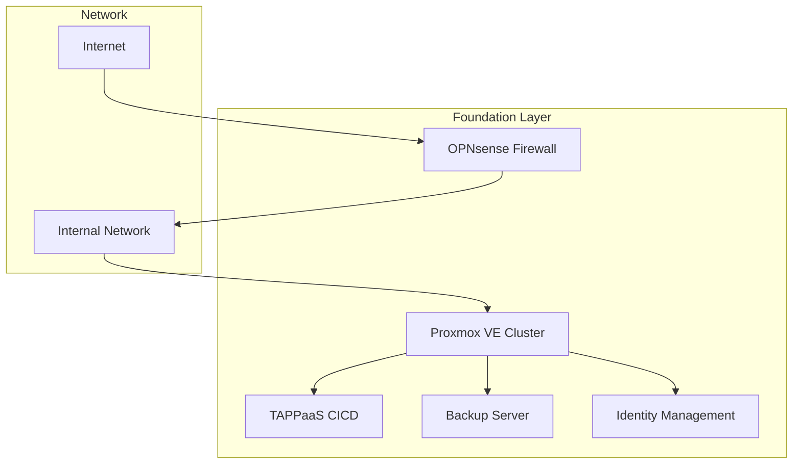

# Foundation

The TAPPaaS Foundation consists of essential modules that must be installed sequentially to establish a functioning system. These modules provide the core infrastructure upon which all other services run.

## Installation Order

!!! important "Sequential Installation Required"
    The foundation modules **must be installed in the numbered order** shown below. Each module depends on the previous ones being properly configured.

## Foundation Modules

| Order | Module | Description |
|-------|--------|-------------|
| 1 | [Proxmox Node](proxmox-node.md) | Initial hypervisor installation |
| 2 | [Firewall](firewall.md) | OPNsense firewall deployment |
| 3 | [Additional Nodes](additional-nodes.md) | Expand cluster with more nodes |
| 4 | [NixOS Template](nixos-template.md) | VM template creation |
| 5 | [CICD Mothership](cicd.md) | Central management VM |
| 6 | [Backup](backup.md) | Proxmox Backup Server |
| 7 | [Identity](identity.md) | Secrets and authentication |
| 8 | [Security](security.md) | System hardening |

## Architecture Overview

## Configuration File

A central `configuration.json` file stores your deployment settings. This file is created during the initial Proxmox node setup and stored at `/root/tappaas/configuration.json` on the CICD mothership VM.

The repository includes a template (`configuration.json.orig`) that should be copied and customized for your environment.

## Quick Start

1. Start with [Proxmox Node](proxmox-node.md) installation on your first server
2. Complete [Firewall](firewall.md) setup before adding more nodes
3. Follow remaining modules in order

## Time Estimate

| Module | Estimated Time |
|--------|----------------|
| Proxmox Node | 30-60 minutes |
| Firewall | 60-90 minutes |
| Additional Nodes | 30 minutes each |
| NixOS Template | 30 minutes |
| CICD Mothership | 45-60 minutes |
| Backup | 30 minutes |
| Identity | 45 minutes |
| Security | 30 minutes |

**Total**: Approximately 4-6 hours for a complete foundation setup.

## Next Steps

Begin with [Proxmox Node](proxmox-node.md) installation.
