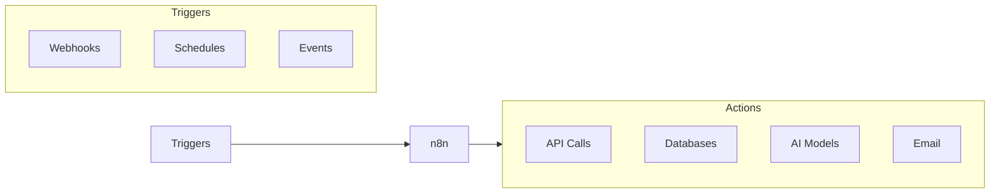

# Productivity Stack

The TAPPaaS Productivity Stack provides workflow automation and productivity tools to streamline your operations.

## Components

| Component | Purpose |
|-----------|---------|
| **n8n** | Workflow automation and integration platform |

## Overview

n8n is a powerful workflow automation tool that allows you to:

- Connect different services and APIs
- Automate repetitive tasks
- Build complex workflows visually
- Integrate with AI capabilities

## Prerequisites

- [ ] [Foundation](../foundation/index.md) complete
- [ ] DNS management access
- [ ] Optional: AI Stack for AI-powered workflows

## System Requirements

| Resource | Minimum | Recommended |
|----------|---------|-------------|
| vCPU | 2 | 4 |
| RAM | 2 GB | 4 GB |
| Storage | 10 GB | 20 GB |

## Use Cases

### IT Operations

- Automated monitoring alerts
- Server provisioning workflows
- Backup verification
- Certificate renewal

### Business Processes

- Data synchronization
- Report generation
- Email automation
- CRM integrations

### AI Workflows

- Document processing with LLMs
- Automated content generation
- Data extraction and analysis
- Chatbot backends

## Architecture

## Installation

-   :material-cog: **[n8n](n8n.md)**

    ---

    Deploy n8n for powerful workflow automation

## Integration with TAPPaaS

n8n integrates well with other TAPPaaS components:

| Integration | Use Case |
|-------------|----------|
| LiteLLM | AI-powered workflows |
| Authentik | SSO authentication |
| VaultWarden | Secure credential storage |
| Home Assistant | Home automation triggers |

## Security Considerations

- Use Authentik for SSO where possible
- Store credentials in VaultWarden
- Limit webhook exposure
- Review workflow permissions regularly
