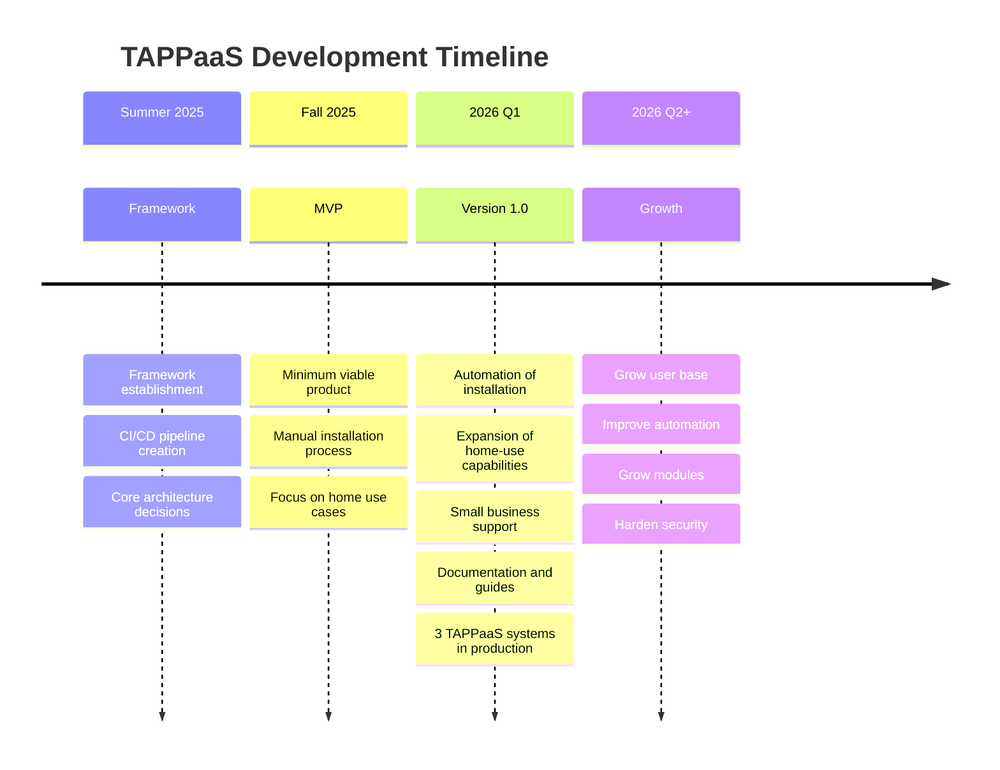

# Development Roadmap

The TAPPaaS team follows a phased approach to building the platform.

---

!!!info "Current Status"
    The project has advanced beyond the framing phase and is actively developing the MVP. We are on track for Version 1.0 by end of Q1 2026.
