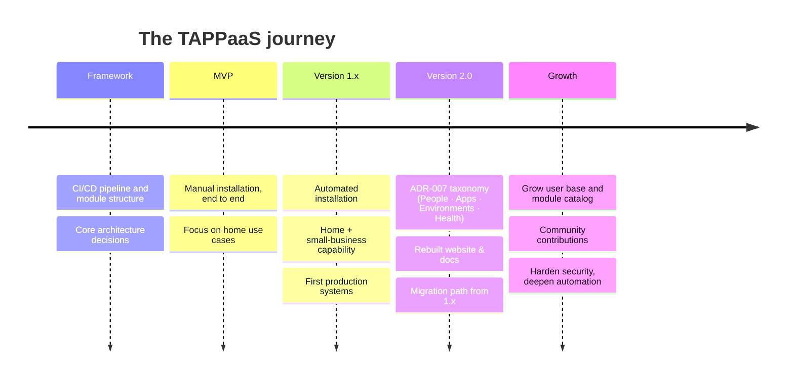

# Roadmap: eating the elephant one bite at a time

*(disclaimer: no elephants were harmed creating TAPPaaS)*

TAPPaaS is built in deliberate phases. This page tells the *shape* of the journey; the
**live specifics — dates, scope, progress — always live in the
[GitHub milestones](https://github.com/TAPPaaS/TAPPaaS/milestones)**, so nothing here
can go stale.

## The phases

```mermaid
timeline
    title The TAPPaaS journey
    Framework : CI/CD pipeline and module structure
              : Core architecture decisions
    MVP : Manual installation, end to end
        : Focus on home use cases
    Version 1.x : Automated installation
                : Home + small-business capability
                : First production systems
    Version 2.0 : ADR-007 taxonomy (People · Apps · Environments · Health)
                : Rebuilt website & docs
                : Migration path from 1.x
    Growth : Grow user base and module catalog
           : Community contributions
           : Harden security, deepen automation
```

**Where we are:** 1.x is released and running on real systems ([examples](../intro/examples.md));
the current focus is **Version 2.0** — the [ADR-007 taxonomy](../installation/branch-selection.md)
and this rebuilt documentation site are part of it.

## How we plan

- **Milestones drive everything.** Each phase is broken into
  [GitHub milestones](https://github.com/TAPPaaS/TAPPaaS/milestones) with issues
  attached; that's the single source of truth for "when" and "what exactly".
- **Architecture is decided in ADRs** in the
  [source repo](https://github.com/TAPPaaS/TAPPaaS/tree/main/docs/ADR) — significant
  choices are written down before they're built.
- **The website upgrade has its own plan** — the documentation re-architecture is
  tracked in [ADR-001 of the Documentation repo](https://codeberg.org/TAPPaaS/Documentation/src/branch/main/ADR/ADR001-rearchitect.md).

## Where to look

| You want… | Go to |
|-----------|-------|
| What's being worked on right now | [Open milestones](https://github.com/TAPPaaS/TAPPaaS/milestones) |
| What 2.0 means for you | [Branch Selection](../installation/branch-selection.md) |
| To influence the direction | [Contributing](../community/contributing.md) · [issues](https://github.com/TAPPaaS/TAPPaaS/issues) |
