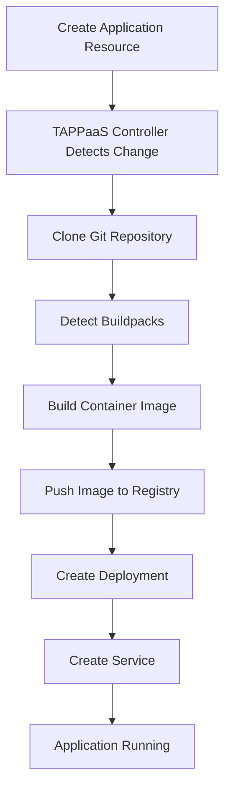

# Deploy Your First App

**Estimated Time**: 20-25 minutes | **Difficulty**: Beginner

This tutorial guides you through deploying your first application on TAPPaaS. You'll learn the complete deployment workflow, from creating an application resource to accessing it in your browser, making updates, and cleaning up resources.

## What You'll Learn

- How to create a TAPPaaS application from source code
- Understanding the build and deployment process
- Accessing your deployed application
- Making changes and redeploying
- Viewing application logs and status
- Cleaning up resources

## What You'll Build

You'll deploy a simple "Hello World" web application that:

- Runs a Python Flask web server
- Returns a welcome message
- Demonstrates the TAPPaaS deployment workflow

## Prerequisites

Before you begin, ensure you have:

- **TAPPaaS installed** in your Kubernetes cluster
    - Complete the [Install TAPPaaS](/tutorials/get-started/install/) tutorial first
- **kubectl** configured to access your cluster
- **(Optional) TAPPaaS CLI** installed for easier interaction
- **Basic understanding** of Git and web applications

!!! tip "Verify Installation"
    Confirm TAPPaaS is running:
    ```bash
    kubectl get pods -n tappas-system
    ```
    All pods should show `STATUS: Running`.

---

## Step 1: Create a Namespace for Your Application

Create a dedicated namespace for your applications:

```bash
kubectl create namespace my-apps
```

**Expected Output:**
```
namespace/my-apps created
```

This keeps your applications organized and isolated from system components.

---

## Step 2: Create Your First Application

Create an application resource using a sample repository. We'll use a pre-built example application.

Create a file named `hello-app.yaml`:

```yaml
apiVersion: tappas.io/v1alpha1
kind: Application
metadata:
  name: hello-world
  namespace: my-apps
spec:
  source:
    git:
      url: https://github.com/TAPPaaS/sample-python-app
      revision: main
  build:
    buildpacks:
      - python
  env:
    - name: PORT
      value: "8080"
  resources:
    requests:
      cpu: 100m
      memory: 128Mi
    limits:
      cpu: 500m
      memory: 512Mi
```

Let's break down what this configuration does:

| Field | Purpose |
|-------|---------|
| `metadata.name` | Unique name for your application |
| `spec.source.git.url` | Git repository containing your application code |
| `spec.source.git.revision` | Branch, tag, or commit to deploy |
| `spec.build.buildpacks` | Language buildpack to use (auto-detected if omitted) |
| `spec.env` | Environment variables for your application |
| `spec.resources` | CPU and memory allocation |

Apply the configuration:

```bash
kubectl apply -f hello-app.yaml
```

**Expected Output:**
```
application.tappas.io/hello-world created
```

---

## Step 3: Monitor the Build Process

TAPPaaS will now build your application from source. Let's watch the process.

Check the application status:

```bash
kubectl get application hello-world -n my-apps
```

**Expected Output:**
```
NAME          STATUS    BUILD STATUS   READY   AGE
hello-world   Building  InProgress     False   30s
```

Watch the build logs in real-time:

=== "Using TAPPaaS CLI"
    ```bash
    tappas logs build hello-world -n my-apps --follow
    ```

=== "Using kubectl"
    ```bash
    # First, get the build pod name
    kubectl get pods -n my-apps -l app=hello-world,component=build

    # Then view logs
    kubectl logs -n my-apps -l app=hello-world,component=build --follow
    ```

**Expected Build Log Output:**
```
[detector] ======== Detecting Buildpacks ========
[detector] ✓ python 1.0.0
[detector]
[builder] ======== Building Application ========
[builder] ✓ Installing Python 3.11
[builder] ✓ Installing dependencies from requirements.txt
[builder] ✓ Collecting Flask
[builder] ✓ Build successful
[exporter] Exporting to registry...
[exporter] ✓ Image exported: registry.tappas-system.svc.cluster.local/my-apps/hello-world:latest
```

The build process typically takes 2-5 minutes depending on:

- Application dependencies
- Cluster resources
- Network speed for downloading dependencies

!!! info "Build Process"
    TAPPaaS uses [Cloud Native Buildpacks](https://buildpacks.io/) to automatically detect your application's language and framework, install dependencies, and create an optimized container image.

---

## Step 4: Verify Deployment

Once the build completes, TAPPaaS automatically deploys your application.

Check the application status:

```bash
kubectl get application hello-world -n my-apps
```

**Expected Output:**
```
NAME          STATUS    BUILD STATUS   READY   AGE
hello-world   Running   Succeeded      True    5m
```

View the deployment details:

```bash
kubectl describe application hello-world -n my-apps
```

**Expected Output:**
```
Name:         hello-world
Namespace:    my-apps
Status:       Running
Ready:        True
Build Status: Succeeded
Image:        registry.tappas-system.svc.cluster.local/my-apps/hello-world:latest
Replicas:     1/1
Events:
  Type    Reason           Age   Message
  ----    ------           ----  -------
  Normal  BuildStarted     5m    Build started for revision main
  Normal  BuildSucceeded   3m    Build completed successfully
  Normal  DeploymentReady  2m    Deployment is ready
```

Check the running pods:

```bash
kubectl get pods -n my-apps -l app=hello-world
```

**Expected Output:**
```
NAME                           READY   STATUS    RESTARTS   AGE
hello-world-7d8c9f5b6a-x4k2m   1/1     Running   0          2m
```

---

## Step 5: Access Your Application

Now that your application is deployed, let's access it.

### Option A: Using Port Forwarding (Quick Test)

Port forwarding creates a temporary local connection to your application:

```bash
kubectl port-forward -n my-apps service/hello-world 8080:8080
```

**Expected Output:**
```
Forwarding from 127.0.0.1:8080 -> 8080
Forwarding from [::1]:8080 -> 8080
```

Open your browser and navigate to:
```
http://localhost:8080
```

**Expected Browser Output:**
```
Hello from TAPPaaS!
Welcome to your first deployed application.
```

Press `Ctrl+C` to stop port forwarding when done.

### Option B: Using Ingress (Production Access)

For persistent access, create an ingress resource:

Create `hello-ingress.yaml`:

```yaml
apiVersion: networking.k8s.io/v1
kind: Ingress
metadata:
  name: hello-world
  namespace: my-apps
  annotations:
    kubernetes.io/ingress.class: nginx
spec:
  rules:
    - host: hello-world.example.com
      http:
        paths:
          - path: /
            pathType: Prefix
            backend:
              service:
                name: hello-world
                port:
                  number: 8080
```

Apply the ingress:

```bash
kubectl apply -f hello-ingress.yaml
```

!!! note "DNS Configuration"
    For production use, configure your DNS to point `hello-world.example.com` to your ingress controller's IP address. For local testing, add an entry to `/etc/hosts`:
    ```
    127.0.0.1 hello-world.example.com
    ```

### Option C: Using TAPPaaS CLI (Easiest)

If you have the TAPPaaS CLI installed:

```bash
tappas open hello-world -n my-apps
```

This automatically opens your application in your default browser.

---

## Step 6: View Application Logs

Monitor your application's runtime logs:

=== "Using TAPPaaS CLI"
    ```bash
    tappas logs hello-world -n my-apps --follow
    ```

=== "Using kubectl"
    ```bash
    kubectl logs -n my-apps -l app=hello-world --follow
    ```

**Expected Log Output:**
```
 * Serving Flask app 'app'
 * Debug mode: off
WARNING: This is a development server. Do not use it in a production deployment.
 * Running on all addresses (0.0.0.0)
 * Running on http://127.0.0.1:8080
 * Running on http://10.244.1.5:8080
Press CTRL+C to quit
127.0.0.1 - - [16/Feb/2026 10:45:00] "GET / HTTP/1.1" 200 -
```

---

## Step 7: Make Changes and Redeploy

Let's modify the application and see how TAPPaaS handles updates.

### Trigger a Rebuild

To deploy a new version, update the application resource:

```bash
kubectl annotate application hello-world -n my-apps \
  tappas.io/rebuild="$(date +%s)" \
  --overwrite
```

This triggers a new build from the latest source code. Watch the build process:

```bash
kubectl get application hello-world -n my-apps --watch
```

**Expected Output:**
```
NAME          STATUS     BUILD STATUS   READY   AGE
hello-world   Building   InProgress     True    10m
hello-world   Deploying  Succeeded      False   11m
hello-world   Running    Succeeded      True    12m
```

### Update with a Different Branch or Tag

To deploy a specific version, update the revision:

```bash
kubectl patch application hello-world -n my-apps \
  --type merge \
  -p '{"spec":{"source":{"git":{"revision":"v1.1.0"}}}}'
```

**Expected Output:**
```
application.tappas.io/hello-world patched
```

### Rolling Updates

TAPPaaS performs zero-downtime rolling updates:

1. New version is built
2. New pods are created
3. Health checks ensure new pods are ready
4. Old pods are terminated
5. Traffic switches to new version

You can monitor the rollout:

```bash
kubectl rollout status deployment hello-world -n my-apps
```

**Expected Output:**
```
Waiting for deployment "hello-world" rollout to finish: 1 old replicas are pending termination...
deployment "hello-world" successfully rolled out
```

---

## Step 8: Scale Your Application

Increase the number of running instances:

```bash
kubectl patch application hello-world -n my-apps \
  --type merge \
  -p '{"spec":{"replicas":3}}'
```

**Expected Output:**
```
application.tappas.io/hello-world patched
```

Verify the scaling:

```bash
kubectl get pods -n my-apps -l app=hello-world
```

**Expected Output:**
```
NAME                           READY   STATUS    RESTARTS   AGE
hello-world-7d8c9f5b6a-x4k2m   1/1     Running   0          15m
hello-world-7d8c9f5b6a-p9n3q   1/1     Running   0          30s
hello-world-7d8c9f5b6a-r7t5w   1/1     Running   0          30s
```

Scale back down:

```bash
kubectl patch application hello-world -n my-apps \
  --type merge \
  -p '{"spec":{"replicas":1}}'
```

---

## Step 9: Explore Application Details

View comprehensive application information:

=== "Using TAPPaaS CLI"
    ```bash
    tappas get hello-world -n my-apps
    ```

=== "Using kubectl"
    ```bash
    kubectl get application hello-world -n my-apps -o yaml
    ```

**Key Information to Review:**

- **Status**: Overall application health
- **Build Info**: Image name, build time, buildpacks used
- **Deployment**: Replicas, resource usage, pod status
- **Routes**: URLs where the application is accessible
- **Recent Events**: Build and deployment history

---

## Step 10: Clean Up Resources

When you're done experimenting, clean up the resources:

Delete the application:

```bash
kubectl delete application hello-world -n my-apps
```

**Expected Output:**
```
application.tappas.io/hello-world deleted
```

This automatically removes:

- The application deployment
- Associated pods
- Services
- Build artifacts

Delete the ingress (if created):

```bash
kubectl delete ingress hello-world -n my-apps
```

(Optional) Delete the namespace:

```bash
kubectl delete namespace my-apps
```

!!! warning "Namespace Deletion"
    Deleting the namespace removes ALL applications and resources within it. Use with caution.

---

## Understanding the Deployment Workflow

Here's what happens when you create an application:



**Key Stages:**

1. **Detection**: Controller watches for new Application resources
2. **Source Fetch**: Clones code from Git repository
3. **Build**: Uses buildpacks to create container image
4. **Registry**: Stores image in internal or external registry
5. **Deploy**: Creates Kubernetes Deployment and Service
6. **Ready**: Application pods are running and healthy

---

## Common Patterns and Best Practices

### Environment-Specific Configurations

Use different configurations for dev, staging, and production:

```yaml
# dev-app.yaml
apiVersion: tappas.io/v1alpha1
kind: Application
metadata:
  name: hello-world-dev
  namespace: development
spec:
  source:
    git:
      url: https://github.com/TAPPaaS/sample-python-app
      revision: develop
  env:
    - name: ENVIRONMENT
      value: "development"
    - name: DEBUG
      value: "true"
```

### Using Secrets for Sensitive Data

Never put sensitive data in plain text. Use Kubernetes secrets:

```bash
kubectl create secret generic app-secrets -n my-apps \
  --from-literal=API_KEY=your-secret-key
```

Reference in your application:

```yaml
spec:
  env:
    - name: API_KEY
      valueFrom:
        secretKeyRef:
          name: app-secrets
          key: API_KEY
```

### Health Checks

Add health check endpoints to your application and configure probes:

```yaml
spec:
  health:
    livenessProbe:
      httpGet:
        path: /health
        port: 8080
      initialDelaySeconds: 30
      periodSeconds: 10
    readinessProbe:
      httpGet:
        path: /ready
        port: 8080
      initialDelaySeconds: 5
      periodSeconds: 5
```

---

## Troubleshooting

### Build Fails

If your build fails:

```bash
# Check build logs for errors
tappas logs build hello-world -n my-apps

# Common issues:
# - Missing dependencies in requirements.txt
# - Syntax errors in code
# - Incorrect buildpack selection
```

### Application Won't Start

If pods are crashing:

```bash
# Check pod status
kubectl describe pod -n my-apps -l app=hello-world

# View application logs
kubectl logs -n my-apps -l app=hello-world --tail=50

# Common issues:
# - Port mismatch (app listens on different port than configured)
# - Missing environment variables
# - Resource limits too low
```

### Can't Access Application

If you can't reach your application:

```bash
# Verify service exists
kubectl get service hello-world -n my-apps

# Check service endpoints
kubectl get endpoints hello-world -n my-apps

# Test from within cluster
kubectl run -it --rm debug --image=curlimages/curl --restart=Never \
  -- curl http://hello-world.my-apps.svc.cluster.local:8080

# Common issues:
# - Incorrect port configuration
# - Firewall or network policy blocking traffic
# - Ingress not configured properly
```

### Build Takes Too Long

If builds are slow:

- Check your cluster resources (CPU, memory)
- Reduce dependencies or use caching
- Consider using a pre-built base image
- Ensure good network connectivity to package repositories

---

## Next Steps

Congratulations! You've successfully deployed your first application on TAPPaaS. Now you're ready to:

- **[Configure Your Application](/tutorials/get-started/configure/)** - Learn about environment variables, secrets, and advanced configuration
- **[Scale Your Application](/tutorials/get-started/scale/)** - Explore horizontal and vertical scaling strategies
- **[Monitor and Debug](/tutorials/get-started/monitor/)** - Master observability and troubleshooting
- **[Deploy Real Applications](/tutorials/deployment/)** - Try language-specific deployment guides
- **[Add Database Integration](/tutorials/integration/databases/)** - Connect your app to databases

---

## Summary

In this tutorial, you learned:

- ✅ How to create a TAPPaaS application from a Git repository
- ✅ Understanding the build process with buildpacks
- ✅ Deploying and accessing applications
- ✅ Viewing logs and monitoring status
- ✅ Making updates and triggering redeployments
- ✅ Scaling applications horizontally
- ✅ Cleaning up resources

**Ready to configure your application?** Continue to [Configure Application](/tutorials/get-started/configure/).
