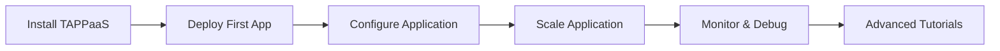

# Get Started with TAPPaaS

Welcome to the TAPPaaS getting started tutorial series! These tutorials will guide you from installation through your first deployment, configuration, scaling, and monitoring. By the end, you'll have a solid foundation for deploying and managing applications on TAPPaaS.

## What You'll Learn

This tutorial series covers:

- **Installation**: Setting up TAPPaaS in your Kubernetes cluster
- **Deployment**: Deploying your first application from source code
- **Configuration**: Managing environment variables, secrets, and settings
- **Scaling**: Horizontal and vertical scaling strategies
- **Monitoring**: Viewing logs, metrics, and debugging applications

## Prerequisites

Before starting these tutorials, you should have:

- **A Kubernetes cluster** (version 1.24 or higher)
    - Local options: [minikube](https://minikube.sigs.k8s.io/), [kind](https://kind.sigs.k8s.io/), [k3s](https://k3s.io/)
    - Cloud options: GKE, EKS, AKS, or any CNCF-certified Kubernetes
- **kubectl CLI** installed and configured to access your cluster
- **Helm 3** (version 3.8 or higher) for installation
- **Basic familiarity** with command line operations
- **Text editor** for creating and editing configuration files

!!! info "Cluster Resources"
    For these tutorials, a cluster with at least 4 CPU cores and 8GB RAM is recommended. Smaller clusters may work but could experience performance limitations.

## Tutorial Series

### 1. Install TAPPaaS
**Estimated Time**: 15-20 minutes | **Difficulty**: Beginner

Learn how to install TAPPaaS in your Kubernetes cluster using Helm. You'll verify the installation and understand the components deployed.

[Start Tutorial →](/tutorials/get-started/install/)

**What you'll accomplish:**

- Install TAPPaaS using Helm
- Verify all components are running
- Understand the TAPPaaS architecture
- Configure basic settings

---

### 2. Deploy Your First App
**Estimated Time**: 20-25 minutes | **Difficulty**: Beginner

Deploy a sample application using TAPPaaS. You'll learn the deployment workflow, access your application, and make updates.

[Start Tutorial →](/tutorials/get-started/deploy-first-app/)

**What you'll accomplish:**

- Create your first application resource
- Deploy from a Git repository
- Access your deployed application
- Update and redeploy your application
- Clean up resources

---

### 3. Configure Application
**Estimated Time**: 25-30 minutes | **Difficulty**: Beginner

Learn how to configure applications with environment variables, secrets, and custom settings. You'll explore different configuration methods and best practices.

[Start Tutorial →](/tutorials/get-started/configure/)

**What you'll accomplish:**

- Set environment variables
- Manage secrets securely
- Configure build and runtime settings
- Use configuration files
- Override default behaviors

---

### 4. Scale Your Application
**Estimated Time**: 20-25 minutes | **Difficulty**: Beginner

Explore horizontal and vertical scaling strategies. You'll learn how to scale applications based on load and optimize resource allocation.

[Start Tutorial →](/tutorials/get-started/scale/)

**What you'll accomplish:**

- Scale application instances (horizontal scaling)
- Adjust CPU and memory resources (vertical scaling)
- Configure autoscaling
- Understand resource requests and limits
- Monitor scaling behavior

---

### 5. Monitor and Debug
**Estimated Time**: 25-30 minutes | **Difficulty**: Beginner

Master application monitoring and debugging. You'll learn to access logs, view metrics, and troubleshoot common issues.

[Start Tutorial →](/tutorials/get-started/monitor/)

**What you'll accomplish:**

- View application logs
- Access metrics and performance data
- Debug deployment issues
- Troubleshoot runtime errors
- Use TAPPaaS CLI for diagnostics

---

## Learning Path

We recommend completing the tutorials in order, as each builds on concepts from the previous ones:

## Estimated Total Time

Completing all five tutorials will take approximately **1.5 to 2 hours**. You can complete them in one session or break them into smaller learning segments.

## Next Steps After Completion

Once you've completed the getting started series, you're ready to:

- **Deploy Real Applications**: Try [language-specific deployment guides](/tutorials/deployment/)
- **Add Integrations**: Connect [databases](/tutorials/integration/databases/) or set up [custom domains](/tutorials/integration/domains/)
- **Explore Advanced Topics**: Learn about [multi-tenancy](/tutorials/operations/multi-tenancy/) or [CI/CD integration](/tutorials/integration/cicd/)
- **Read Concept Docs**: Deepen understanding with [core concepts](/docs/concepts/)
- **Reference Documentation**: Explore the [CLI reference](/docs/cli/) and [API reference](/docs/api/)

## Getting Help

If you encounter issues while working through these tutorials:

- Check the **Troubleshooting** section at the end of each tutorial
- Review the [Operations Guide](/docs/operations/)
- Visit the [Community Forum](https://community.tappas.io)
- Open an issue on [GitHub](https://github.com/TAPPaaS/TAPPaaS)

!!! tip "Feedback Welcome"
    Found an error or have suggestions for improving these tutorials? We'd love to hear from you! Please [open an issue](https://github.com/TAPPaaS/TAPPaaS/issues) or contribute directly.

---

Ready to get started? Begin with [Install TAPPaaS](/tutorials/get-started/install/).
