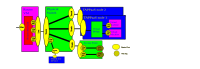

# Design

How TAPPaaS is designed, module by module. Each page below is the module's own
design notes, kept in sync from the source repository.

- **[Cluster](../generated/design/cluster.md)** — the Proxmox/ZFS foundation: storage tiers,
  high availability, adding nodes.
- **[Network](../generated/design/network.md)** — OPNsense firewall, security zones, DNS, the
  reverse proxy, and resilience (including public ingress without a public IP).
- **[Backup](../generated/design/backup.md)** — the 3-2-1 strategy, PBS placement, off-site
  replication, and disaster recovery.

## Physical network & VLANs

The switching and trunk layout, and how VLAN tags map to security zones — **Service 2xx,
IoT 4xx, DMZ 6xx** (management is untagged). The operational zone definitions are the single
source of truth in [Network Zones](../generated/zones.md).

