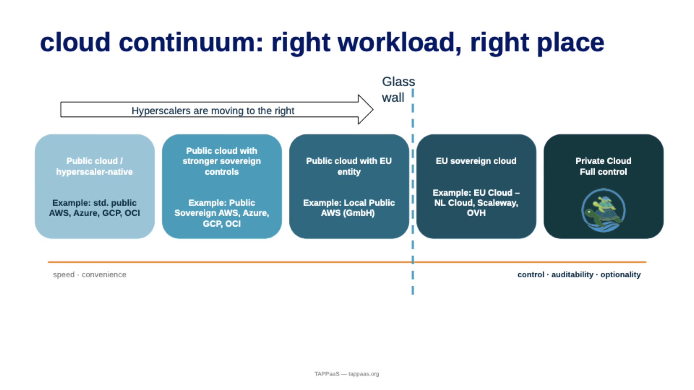
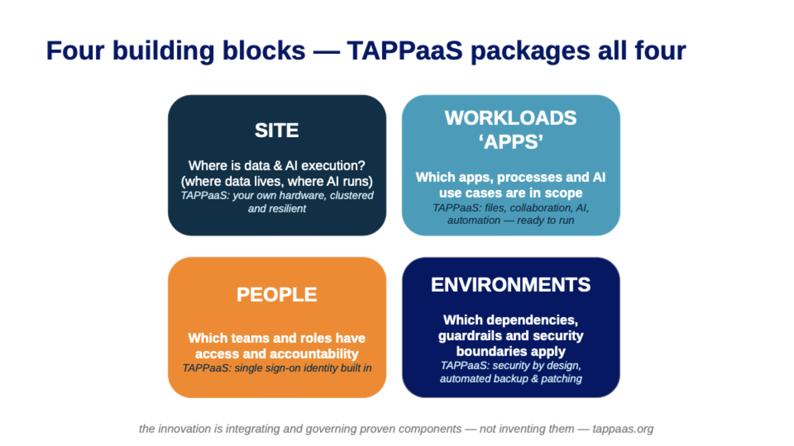
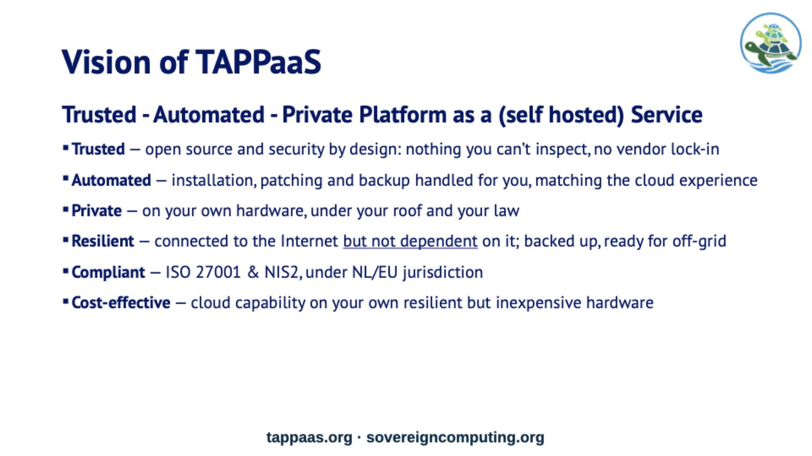

# Why TAPPaaS

Let's start with a simple question: **who is actually in control of your digital life?**

- **Your data** — where it lives, who can read it, whose law applies to it.
- **Your costs** — the cloud bill that only ever goes up.
- **Your access** — whether you could still reach your own systems if a provider,
  a policy, or a geopolitical decision changed tomorrow.

For most organisations the honest answer is: *someone else*. We've traded control for
convenience — and in a world that is getting less stable, not more, that trade is
starting to look expensive.

---

## The cloud is a continuum — and there's a glass wall

The cloud isn't one thing — it's a continuum. On the left, the public hyperscalers:
fast, convenient, and outside your control. Moving right you gain sovereignty —
sovereign controls, EU entities, EU clouds — and at the far end, **private cloud**:
your hardware, your premises, your jurisdiction.

Notice the **glass wall**. The hyperscalers know sovereignty matters — they are all
moving right, adding "sovereign" offerings. But they can never cross that wall: as long
as your infrastructure is owned and operated under someone else's jurisdiction, your
sovereignty is a promise in a contract — **not a fact of architecture**.

And this isn't only about jurisdiction. It's about **resilience**. On the right side of
the wall your systems keep running even if the connection to the outside world doesn't:
connected to the internet, but not dependent on it.

So if the right side is where control and resilience live… why isn't everyone there
already?

---

## The hurdle: what a cloud really is

Here's the uncomfortable truth: the hyperscalers *earned* their position. Their real
product was never servers — it was **packaging**. They took hundreds of complicated
services and wrapped them into something easy, robust and automated.

Because a real cloud platform comes down to **four building blocks**:

1. **Site** — where your data lives and your AI runs: cluster, storage, network, firewall.
2. **Workloads** — the applications your organisation actually uses: files,
   collaboration, automation, AI.
3. **People** — identity, sign-on, who has access to what.
4. **Environments** — the security boundaries, the backup, the patching, the guardrails.

If you wanted to self-host all of that yourself, you would have to become your own cloud
provider: integrate dozens of open-source components, keep them secure, patched and
backed up. *That* is the hurdle — and why organisations that want sovereignty still end
up on the left side of the glass wall.

**TAPPaaS removes that hurdle.** It packages the entire thing — all four building
blocks, pre-integrated, automated and open source. The innovation isn't inventing new
components; it's **curating, integrating and automating** proven ones — so self-hosting
feels like the cloud:

| Principle | What it means |
|-----------|---------------|
| **Curation** | Opinionated selection of mature, actively-maintained FOSS — fewer choices, better fits |
| **Integration** | Components configured to work as one platform: identity, network, backup, ingress |
| **Automation** | Install, patching, and backup handled by the platform — not by hand |

!!! note "The same four blocks, all the way down"
    The four building blocks aren't just marketing: they are the platform's actual
    architectural taxonomy (in the technical docs: *Site · Apps · People ·
    Environments*). The [Architecture section](../develop/index.md) is the same
    model in full technical depth.

---

## The vision: Trusted · Automated · Private

TAPPaaS stands for **Trusted, Automated, Private Platform as a Service** — self-hosted.

- **Trusted** — security by design and fully open source (MPL 2.0): nothing you can't
  inspect, no vendor that can lock you in.
- **Automated** — installation, patching and backup are handled for you, matching the
  cloud experience instead of fighting it.
- **Private** — it runs on your own inexpensive hardware, under your roof and your law —
  which also makes it remarkably cost-effective.

And **resilient by design**: backed up, and ready to run off-grid when it has to.

This isn't a slide-deck vision. TAPPaaS is [**running today**](examples.md) — serving
files, running AI models locally, automating workflows — with its first adopters.

---

## Who is it for?

TAPPaaS serves those who need digital independence but not a dedicated IT department:

- **Small and medium businesses** — reliable office infrastructure on hardware you own,
  without the ever-growing subscription stack.
- **Governments, NGOs and critical-infrastructure providers** — systems that must obey
  local law and keep working when connectivity doesn't.
- **Communities of homes** — shared, self-governed digital services for a
  neighbourhood, cooperative or association.
- **Technically-capable households** — family photos, documents and automation under
  your own roof.

!!! tip "Platform Democracy"
    TAPPaaS is built on the principle that producers are also consumers of the system:
    **we use what we build, and we build what we need.** All of it Free and Open Source
    Software — no proprietary dependencies, mobile-accessible, and offline-capable.

---

## Go deeper

- [Design Principles](../what/principles.md) — the seven rules everything is built by,
  and what TAPPaaS deliberately is *not*.
- [Digital Sovereignty](digital-sovereignty.md) — what sovereignty means, in plain terms.
- [Examples](examples.md) — what people actually run on TAPPaaS today.
- [Install TAPPaaS](../install/index.md) — choose hardware and bootstrap your platform.
- [Architecture](../develop/index.md) — how the four building blocks are built.
